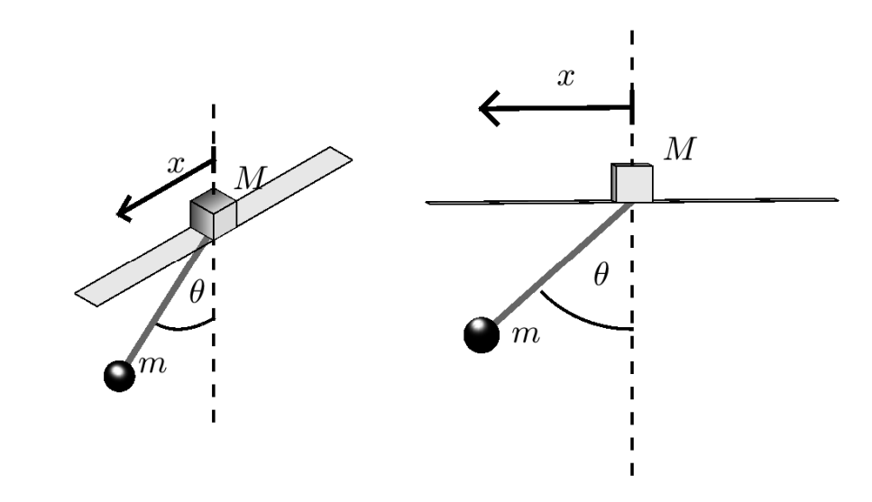
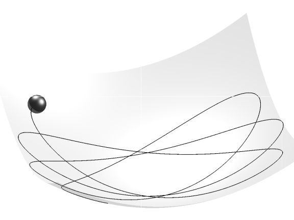

==============================
3D Visualization and Animation
==============================

Visualization is a crucial part of evaluating any attempt of modelling a system. When dealing with a system with more than a couple of parameters, plots become
difficult to interpret. By visualizing our system in 3D we can leverage our spatial and physics intuition of the world. This is the same intuition
which tells us that when we throw a ball, its trajectory should be parabolic, or the intuition that it takes less effort stop a bike than a car.

For mechanical systems, a visualization that “does not look right” can indicate either a model built on fundamentally flawed assumptions or something as simple as an incorrect sign in an expression. Visualizing your system through animation
will help you weed out unintended behaviour from your model and will ultimately deepen your understanding of your model.

This page introduces the basic principles of animating a system in 3D and presents some common frameworks for visualization and animation.

Principles of Animation
===========================

.. raw:: HTML

    
 By <a href="//commons.wikimedia.org/wiki/User:Janke" title="User:Janke">Janke</a> - Own work, <a href="https://creativecommons.org/licenses/by-sa/2.5" title="Creative Commons Attribution-Share Alike 2.5">CC BY-SA 2.5</a>, <a href="https://commons.wikimedia.org/w/index.php?curid=433430">Link</a>

We distinguish between two approaches to animation: **real-time animation** and **precomputed animation**.

**Real-time animation** means that the system is simulated step by step in the same program loop that updates the animation.
After each simulation step, the animation is refreshed to show the new state.This allows for interactive and responsive animations,
but can be computationally demanding for complex systems or stiff systems that demand fine time resolutions.

**Precomputed animation** uses pre-generated trajectories (state over time). We compute the system's trajectory
*before* animating, and play back the trajectory upon animation. This approach is often more practical and efficient,
as it allows us to decouple simulation from rendering. This allows us to reuse our simulation data, and is generally
more stable for visualization purposes.

In both cases, we need a time series of the **trajectory** of our system. This trajectory could include positions, orientations
and other relevant quantities and measures. Additionally, we need to specify the time step or **frame duration** between each state,
as this determines how long each animation frame should last, consequently determining our frame rate (frames/second). Matching the
animation frame rate with the simulation time step produces a reproduction of the system's motion. However, in some cases
adjusting the playback speed (faster or slower) can be both practically useful (i.e. a very slow or fast system).

A trajectory alone is not very useful to animate without a corresponding 3D (or 2D) model of the system.
This model does not need to be photorealistic nor physically accurate. It just needs to capture the
essential geometry and behaviour of our system. For example, the details on the bike seat are of little interest when analysing the motion of a bike.

Most animation libraries include primitive geometric shapes like cubes, spheres and cylinders, which
are usually sufficient to represent the key components of a system. Even a very simple model can be effective,
because the human brain is highly skilled at filling in missing detail when the motion appears convincing.
A simple rectangle moving like a boat can evoke the image of a vessel at sea given that the motion behaves as expected.

Our advice: **start simple**. Focus on correct motion first, as you undoubtedly will make some
interesting mistakes with reference frames and defining coordinate systems. You can always improve the visual flair and fidelity later.
The goal is by no means to produce a Pixar-quality animation, but rather to understand and effectively communicate how your system behaves.

In the following sections, we'll present four animation tools of increasing complexity, from
lightweight plotting using Matplotlib to state-of-the-art 3D engines using Blender.

Matplotlib.animation
=====================

.. note::

    Matplotlib is quite old and rigorous for simple data visualization. If you want to plot simple 2D data, we recommend checking out `Plotly <https://plotly.com/python/>`_ for
    a more modern plotting library. However, Plotly it is not designed for 3D animation.

Many of you are already familiar with the Matplotlib library. Inspired by Matlab's plotting library, Matplotlib offers many useful easy-to-use functions for plotting
and visualizing data. While the library was made with data visualization in mind, it also supports a rudimentary framework for plotting and animating in 3D.
In this section we will go through a basic example of a 3D pendulum with damping. For a more comprehensive introduction to Matplotlib.animation, take a look at
the `official documentation <https://matplotlib.org/stable/users/explain/animations/animations.html#animations-using-matplotlib>`_.

Example: Pendulum
--------------------

In this example we'll simulate a 3D pendulum with damping terms.

.. dropdown:: Derivation

    We consider a point mass :math:`m` suspended by a rigid rod of length :math:`L` from a fixed pivot. Using spherical coordinates, the generalized coordinates are

    .. math::
       q = \begin{bmatrix} \theta \\ \phi \end{bmatrix},

    where :math:`\theta` is the polar angle from the vertical and :math:`\phi` is the azimuthal angle around the vertical axis.

    The position of the mass is :math:`\mathbf{r} = L(\sin\theta\cos\phi, \sin\theta\sin\phi, -\cos\theta)`. Computing the kinetic energy :math:`T = \tfrac{1}{2}m|\dot{\mathbf{r}}|^2` gives us

    .. math::
       T = \tfrac{1}{2}mL^2\left[\dot{\theta}^2 + \sin^2\theta \, \dot{\phi}^2\right]

    The potential energy, with reference at the pivot at the origin, is

    .. math::
       V = -mgL\cos\theta.

    Thus, the Lagrangian can be expressed as

    .. math::
       \mathcal{L} = T - V.

    The kinetic energy can be written in quadratic form

    .. math::
       T = \tfrac{1}{2} \dot{q}^\mathsf{T} W(q)\, \dot{q},

    with inertia matrix

    .. math::
       W(q) = mL^2
       \begin{bmatrix}
         1 & 0 \\
         0 & \sin^2\theta
       \end{bmatrix}

    The Euler-Lagrange equations yield

    .. math::
       W(q) \, \ddot{q} + c(q, \dot{q}) + g(q) = 0,

    where

    .. math::
       c(q, \dot{q}) = mL^2
       \begin{bmatrix}
          -\sin\theta\cos\theta \, \dot{\phi}^2 \\
          -2\cos\theta \, \dot{\theta}\dot{\phi}
       \end{bmatrix},
       \qquad
       g(q) =
       \begin{bmatrix}
          mgL\sin\theta \\
          0
       \end{bmatrix}.

    The final equations of motion are

    .. math::
       \begin{bmatrix}
       mL^2 & 0 \\
       0 & mL^2\sin^2\theta
       \end{bmatrix}
       \begin{bmatrix}
       \ddot{\theta} \\ \ddot{\phi}
       \end{bmatrix}
       +
       \begin{bmatrix}
       -mL^2\sin\theta\cos\theta \, \dot{\phi}^2 + mgL\sin\theta \\
       -2mL^2\cos\theta \, \dot{\theta}\dot{\phi}
       \end{bmatrix}
       = 0.

    This compact form can be inverted to solve for :math:`\ddot{\theta}` and :math:`\ddot{\phi}` explicitly:

    .. math::
       \ddot{\theta} &= \sin\theta\cos\theta \, \dot{\phi}^2 - \frac{g}{L}\sin\theta \\
       \ddot{\phi} &= -\frac{2\cos\theta}{\sin\theta} \dot{\theta}\dot{\phi}

    Adding damping terms :math:`-c\dot{\theta}` and :math:`-c\dot{\phi}`, we finally have:

    .. math::
       \ddot{\theta} &= \sin\theta\cos\theta \, \dot{\phi}^2 - \frac{g}{L}\sin\theta - c\dot{\theta} \\
       \ddot{\phi} &= -\frac{2\cos\theta}{\sin\theta} \dot{\theta}\dot{\phi} - c\dot{\phi}

From Euler-Lagrange using vertical angle :math:`\theta` and azimuth :math:`\phi` as generalized coordinates we get the following EoM:

.. note::
    This simplified damping model works for demonstration but isn't fully realistic

.. math::
   \ddot{\theta} &= \sin\theta\cos\theta \, \dot{\phi}^2 - \frac{g}{L}\sin\theta - c\dot{\theta} \\
   \ddot{\phi} &= -\frac{2\cos\theta}{\sin\theta} \dot{\theta}\dot{\phi} - c\dot{\phi}

We separate the second order ODE into four first order ODEs on the standard SciPy format. We also define our parameters.

.. jupyter-execute::

    import numpy as np

    g, L = 9.81, 2.0
    c = 0.5  # damping coeff

    def spherical_pendulum_damped(t, y):
        theta, theta_dot, phi, phi_dot = y
        theta_ddot = (np.sin(theta)*np.cos(theta)*phi_dot**2
                      - (g/L)*np.sin(theta)
                      - c*theta_dot)
        phi_ddot = (-2*np.cos(theta)/max(np.sin(theta), 1e-6))*theta_dot*phi_dot - c*phi_dot # Numerical stability
        return [theta_dot, theta_ddot, phi_dot, phi_ddot]

Integrating with SciPy

.. jupyter-execute::

    from scipy.integrate import solve_ivp
    # Initial conditions
    theta0, theta_dot0 = 0.8, 0.0
    phi0, phi_dot0 = 0.8, 2.0

    # Integrate
    t_span = (0, 10) # 10 seconds
    t_eval = np.linspace(*t_span, 600) # Resolution
    y0 = [theta0, theta_dot0, phi0, phi_dot0]
    sol = solve_ivp(spherical_pendulum_damped, t_span, y0, t_eval=t_eval)

    theta, phi = sol.y[0], sol.y[2] # Extract trajectory polar coordinates

Polar coordinates can be tricky to work with, so to make the animation code simpler we convert to Cartesian

.. jupyter-execute::

    x = L * np.sin(theta) * np.cos(phi)
    y = L * np.sin(theta) * np.sin(phi)
    z = -L * np.cos(theta)

Similar to an ordinary plot, we create a figure with :code:`plt.fig()` and add a 3D subplot. We can also set the bounds
of our plot explicitly by :code:`set_lim()` for all axes.

.. jupyter-execute::

    import matplotlib.pyplot as plt

    fig = plt.figure()
    ax = fig.add_subplot(111, projection="3d")
    ax.set_xlim(-L, L)
    ax.set_ylim(-L, L)
    ax.set_zlim(-L, 0.5*L)
    ax.set_box_aspect([1, 1, 0.6]) # Not strictly necessary, but nice for web view

We have now created out plot. Now for the animation. The simplest way to animate using Matplotlib is to define
a trajectory for every object in your system. We create one for the line (rod) and one for the bob (mass attached to rod).
Like any other plot we can pick the formatting for each of the trajectories.

.. jupyter-execute::

    line, = ax.plot([], [], [], lw=2, c="black") # The comma "," unpacks the one-element list returned by ax.plot()
    bob, = ax.plot([], [], [], "o", c="red", markersize=8)

We will now define the functions we need to animate the trajectory using :code:`FuncAnimation`. Apart from our figure and data,
the animation function needs an initialization function and an update function to animate our trajectory. The initialization
function sets up all the properties we need for the trajectories we animate, and gets called whenever we reset or restart our animation.
The update function takes in which time step we are on, and returns the updated trajectory of the objects we animate.

That's it!

.. jupyter-execute::

    def init():
        line.set_data([], [])
        line.set_3d_properties([])
        bob.set_data([], [])
        bob.set_3d_properties([])
        return line, bob

    def update(i):
        line.set_data([0, x[i]], [0, y[i]])
        line.set_3d_properties([0, z[i]])
        bob.set_data([x[i]], [y[i]])
        bob.set_3d_properties([z[i]])
        return line, bob

Then we just have to pass our figure, functions and remaining parameters.
The frame argument is the number of steps we integrated is self explanatory. The interval parameter controls milliseconds between frames, use 50-100ms for smooth playback.
Additionally, you can use :code:`blit=True` to make the animation more efficient, as it makes sure only
updated pixels are drawn for every frame. If the animation doesn't appear when testing locally, try removing `blit=True` or use `plt.show()` instead of HTML display.

.. jupyter-execute::

    from matplotlib.animation import FuncAnimation
    from IPython.display import HTML # HTML needed to display on webpage

    ani = FuncAnimation(fig, update, frames=len(t_eval), init_func=init,
                        blit=True, interval=10)

    plt.close(fig)  # suppress static plot, animate using HTML instead
    HTML(ani.to_jshtml()) # Display inline

Alternative display methods include `plt.show()` for interactive viewing or `ani.save('pendulum.mp4')` to save as video.
Matplotlib animations may behave differently depending on your backend. If the animation does not display properly, try switching backends before importing pyplot:

.. code-block:: python3

    import matplotlib
    matplotlib.use('TkAgg')  # or 'Qt5Agg', 'notebook' for Jupyter
    import matplotlib.pyplot as plt

Common backends include TkAgg for desktop applications, Qt5Agg for interactive plots and 'notebook' for Jupyter environments, such as Jupyter notebooks.

Pythreejs
======================

.. warning::

    This is a sparsely maintained Python package. It's simple to use, but since compatibility is not guaranteed, use it at your own risk.

`Pythreejs <https://pythreejs.readthedocs.io/en/stable/>`_ is a Jupyter widgets based notebook extension (library made specifically for Jupyter notebooks) that makes it possible to use
some of the capabilities of the widely popular 3D animation framework `threejs <https://threejs.org>`_. From the name you probably figured out that threejs is written in Javascript.
Since we use Python in this course we will introduce threejs through pythreejs first, and then take a look at threejs. In this section we go through a simple example using pythreejs. We'll introduce concepts such as *scenes*, *cameras* and much more.

Example: Pendulum-cart
-------------------------

The example system we will be animating is a cart pendulum with a mass or bob attached at the end, as shown in :ref:`fig:pendulum_w_cart` :cite:`gros2011`). We will ignore collision and friction forces for now.

.. _fig:pendulum_w_cart:

   Cart with pendulum

.. dropdown:: Derivation

    We consider a cart of mass :math:`M` moving horizontally, with a pendulum
    of mass :math:`m` and length :math:`L` attached at its pivot.

    Using Euler-Lagrange, the generalized coordinates are chosen as

    .. math::

       q = \begin{bmatrix} x \\ \theta \end{bmatrix},

    where :math:`x` is the horizontal displacement of the cart and
    :math:`\theta` is the pendulum angle from the y-axis.

    The standard formulation for kinetic energy gives us

    .. math::

       T = \tfrac{1}{2}(M+m)\dot{x}^2
           + mL\cos\theta \,\dot{x}\dot{\theta}
           + \tfrac{1}{2} m L^2 \dot{\theta}^2

    Using the same principle, we have potential energy

    .. math::

       V = m g L \cos\theta.

    Thus, the Lagrangian is

    .. math::

       \mathcal{L} = T - V.

    The kinetic energy can be written in quadratic form

    .. math::

       T = \tfrac{1}{2} \dot{q}^\mathsf{T} W(q)\, \dot{q},

    with inertia matrix

    .. math::

       W(q) =
       \begin{bmatrix}
         M + m & m L \cos\theta \\
         m L \cos\theta & m L^2
       \end{bmatrix}

    The Euler-Lagrange equations yield

    .. math::

       W(q) \, \ddot{q} + c(q, \dot{q}) + g(q) = 0,

    where

    .. math::

       c(q, \dot{q}) =
       \begin{bmatrix}
          -m L \sin\theta \, \dot{\theta}^2 \\
          0
       \end{bmatrix},
       \qquad
       g(q) =
       \begin{bmatrix}
          0 \\
          m g \sin\theta
       \end{bmatrix}.

    Thus, the final equations of motion are

    .. math::

       \begin{bmatrix}
       M+m & mL\cos\theta \\
       mL\cos\theta & mL^2
       \end{bmatrix}
       \begin{bmatrix}
       \ddot{x} \\ \ddot{\theta}
       \end{bmatrix}
       +
       \begin{bmatrix}
       -mL\sin\theta \, \dot{\theta}^2 \\
       m g \sin\theta
       \end{bmatrix}
       = 0.

    This compact form can be inverted to solve for :math:`\ddot{x}` and
    :math:`\ddot{\theta}` explicitly:

    .. math::

       \ddot{q} = - W(q)^{-1} \left[ c(q,\dot{q}) + g(q) \right].

From the derivation above we have the EoM

.. math::

    \ddot{q} = - W(q)^{-1} \left[ c(q,\dot{q}) + g(q) \right],
    \qquad q := \begin{bmatrix} x \\ \theta \end{bmatrix}

where

.. math::

    c(q, \dot{q}) =
    \begin{bmatrix}
      -m L \sin\theta \, \dot{\theta}^2 \\
      0
    \end{bmatrix},
    \qquad
    g(q) =
    \begin{bmatrix}
      0 \\
      m g \sin\theta
    \end{bmatrix},
    \qquad
    W(q) = \begin{bmatrix}
    M+m & mL\cos\theta \\
    mL\cos\theta & mL^2
    \end{bmatrix}

We start by defining our system of first order ODEs as a Python function

.. jupyter-execute::

    import numpy as np

    def cart_pendulum_ode(state, t, L, m, M):
        theta, theta_dot, x, x_dot = state
        g = 9.81
        S, C = np.sin(theta), np.cos(theta)

        W = np.array([
            [M + m,      m*L*C],
            [m*L*C,      m*L**2]
        ])

        f = np.array([
            -m*L*S*theta_dot**2,
            m*g*S
        ])

        q_ddot = np.linalg.solve(W, -f) # Solve to get rhs
        x_ddot, theta_ddot = q_ddot[0], q_ddot[1]
        return [theta_dot, theta_ddot, x_dot, x_ddot] # Same shape as input

We then define our parameters and generate our trajectory by integrating with SciPy.

.. jupyter-execute::

    from scipy.integrate import odeint

    time = np.arange(0, 30, 0.1) # 30 seconds, 100ms step size
    L = 3 # meters
    m = 1 # kg
    M = 3 # kg
    initial_state = [0.7, 0, 0, 0]
    solution = odeint(cart_pendulum_ode, initial_state, time, args=(L, m, M))

We then have to extract the Cartesian coordinates of the pendulum bob and the cart.
Here we can define additional offsets, such as where in the scene the cart is placed initially etc.

.. jupyter-execute::

    cart_y = 0.5 # Y-offset

    x_pos = solution[:, 2] # Solution has the following shape [time, state(s)]
    x_vals = [[x, cart_y, 0] for x in x_pos] # Append the additional Y-offset

    pendulum_vals = [ # We have to convert the generalized coordinates into Cartesian coordinates
        [x + L*np.sin(theta), cart_y - L*np.cos(theta), 0]
        for theta, x in zip(solution[:,0], x_pos)
    ]

Pythreejs expects a contiguous (flattened) list of coordinates, and not a multidimensional array, so we have to flatten our
coordinate arrays to get it on the form :math:`[x0, y0, z0, x1, y1, z1, x2 ...]`. Luckily, numpy has a built-in method to
flatten ND-arrays to 1D arrays, namely :code:`.ravel()`

.. jupyter-execute::

    cart_values = np.asarray(x_vals).ravel()
    pend_values = np.asarray(pendulum_vals).ravel()

We now have the trajectory we want to animate. Next up is importing pythreejs and setting up our **scene**.
In animation, a scene is an environment containing 3D models, lights, cameras, and other elements arranged and animated together to represent a specific part of an animation sequence.
We start by defining our camera, which will be what we observe our scene through. There are many possible parameters we can tweak, but the most important
are its `aspect ratio <https://en.wikipedia.org/wiki/Aspect_ratio_(image)>`_ and position.

.. jupyter-execute::

    import pythreejs as pj
    import ipywidgets as widgets
    from IPython.display import display

    camera = pj.PerspectiveCamera(position=[0, 0, 7], aspect=6/4)

Next, we then define our scene. In pythreejs, a scene is defined by passing a list of objects to the *children=* parameter.
These children represent all the elements contained within the scene, including cameras, light sources and meshes.
When the scene is rendered, every child object in this list is included and displayed together as part of the scene.
This allows easy grouping of all objects that make up the 3D environment. In this example we use directional light as a light source,
which we have to set a position and intensity for. Other light sources, such as ambient light, can also be used.

.. jupyter-execute::

    scene = pj.Scene(children=[camera, pj.DirectionalLight(position=[0, 3, 7], intensity=0.6),])
    renderer = pj.Renderer(scene=scene, camera=camera, controls=[pj.OrbitControls(controlling=camera)], width=600, height=400)

We now have have a scene to put our objects into. Pythreejs includes geometric primitives we can use to represent elements like our cart and pendulum.
Each object in the scene must be associated with a **mesh**, which is a combination of geometry (the shape of the object) and material (its appearance).
The renderer is the component that converts the entire scene, including all meshes, lights and cameras, into pixels displayed on the screen. Since the
renderer cannot process abstract objects directly, meshes serve as the concrete representations of these objects that can be rendered visually.
This setup ensures that every object has a defined shape and appearance allowing the renderer to generate the final visual output of the scene accurately.
For every mesh we also need to specify its material. In this example we use MeshLambertMaterial, which tells Pythreejs to render our meshes with `lambertian reflectance <https://en.wikipedia.org/wiki/Lambertian_reflectance>`_.

.. jupyter-execute::

    cart = pj.BoxGeometry(1, 1, 1)
    cart

.. jupyter-execute::

    cart_mesh = pj.Mesh(cart, material=pj.MeshLambertMaterial(color='red', side='FrontSide'))
    bob = pj.SphereGeometry(radius=0.2)
    bob_mesh = pj.Mesh(bob, pj.MeshLambertMaterial(color='blue'))
    rod = pj.CylinderGeometry(radiusTop=0.05, radiusBottom=0.05, height=L)
    rod_mesh = pj.Mesh(rod, material=pj.MeshLambertMaterial(color='black'))

In case where multiple objects have the same relative motion, we can define a group. Much like a rigid group in mechanics, we can define
objects' relative position within that group. In the case of the cart and pendulum we know that the bob and rod will have have the same relative
movement around the pivot the rod is attached to. This can simplify our animation, since we can use the angle of the pendulum to animate the
motion of the mass and rod instead of the individual Cartesian coordinates over time.

.. jupyter-execute::

    pivot = pj.Group(position=[0, 0, 0])
    cart_mesh.add(pivot)
    scene.add(cart_mesh) # Make sure to add pivot to cart before adding to scene

    rod_mesh.position = [0, -L/2, 0] # top at pivot
    bob_mesh.position = [0, -L, 0] # at end of rod

    pivot.add(rod_mesh)
    pivot.add(bob_mesh)
    cart_mesh

We now have all the objects and meshes we need in our scene. We now need to link the motion of our system to the individual components
in our scene. This is done with **keyframe tracks** which determine the motion of objects throughout our animation.
Keyframe tracks store arrays of keyframe data and interpolate between these keyframes to create smooth animations of various properties (positions, rotations, scales, colors, etc.) over time.
To be able to easily track our objects we give names to each of the meshes and groups in our scene.

We can then define the keyframe track of the position of the cart. The :code:`VectorKeyframeTrack` takes the target object and property,
an array of time values, and corresponding position vectors

Animating the rotation of the pivot group can be done using quaternions (see Quaternions page).
In short, quaternions provide a robust way to represent rotations without suffering from gimbal lock, and they interpolate smoothly between orientations.
For a pendulum rotating around the z-axis, we construct quaternions where the rotation angle θ maps to the quaternion :math:`[0, 0, sin(θ/2), cos(θ/2)]`:

.. note::

    Naming needs to be in the same Jupyter notebook block where they are used

.. jupyter-execute::

    cart_mesh.name = "cart_mesh"
    pivot.name = "pivot"

    cart_position_track = pj.VectorKeyframeTrack(name="cart_mesh.position", times=time, values=cart_values)
    angles = solution[:, 0]
    pend_values = np.array([[0 , 0, np.sin(a/2), np.cos(a/2)] for a in angles]) # Quaternions
    rotation_track = pj.QuaternionKeyframeTrack("pivot.quaternion", times=time, values=pend_values)

The :code:`AnimationAction` object provides methods to play, pause, stop, and control the animation.
The :code:`AnimationMixer` handles the actual updating of object properties based on the keyframe data, while the :code:`AnimationClip` bundles together all the keyframe tracks that should play simultaneously.

.. jupyter-execute::

    clip = pj.AnimationClip(tracks=[cart_position_track, rotation_track], duration=time[-1])
    mixer = pj.AnimationMixer(cart_mesh)
    action = pj.AnimationAction(mixer, clip, cart_mesh)
    renderer.layout = widgets.Layout(width="100%", height="auto") # For display compatibility

    renderer

We then call action in a separate block to control our animation.

.. jupyter-execute::

    action

Three.js
======================

.. note::

    This section requires some knowledge of HTML and Javascript. For simple scripting and animation, this can easily be learned by example or
    generated by the large language model of your choice.

Long gone are the days of text-based web browsers, and they have since evolved into powerful platforms that function like operating systems with hardware acceleration and impressive graphics capabilities.
By utilizing the power of modern web browsers and WebGL we can create versatile visualizations and animations compatible with any modern device with a browser.
`Three.js <https://threejs.org>`_ is one of the most popular open-source JavaScript libraries that enables the creation and display of animated 3D graphics in web browsers.
It runs on all modern browsers without plugins, and offers real-time rendering, various geometries, lighting effects and interactive controls.
It also supports more sophisticated tools for loading 3D models, post-processing effects and even virtual/augmented reality capabilities.

This section covers some of the basics of creating animations using Three.js with a simple rolling ball example.
If you would like to learn more, we recommend checking out the `impressive library of examples on the
official website <https://threejs.org/examples/#webgl_animation_keyframes>`_. For a more in-depth introduction to Three.js, check out `Discover Threejs <https://discoverthreejs.com>`_.

Example: Sphere in bowl simulation
------------------------------------

.. _fig:lagrangebowl:

   Sphere in parabolic bowl

In this example the idea is to simulate and animate a sphere rolling in a parabolic bowl assuming no slipping, as shown in :numref:`fig:lagrangebowl` :cite:`gros2011`.
For convenience, we use SymPy to derive our equations of motion (see :ref:`Numerical Methods for ODEs`).

.. dropdown:: Derivation with SymPy

    We pick the following parabolic surface

    .. math::

        z = \frac{1}{4} (x^2 + y^2)

    On a parabolic surface we can use the :math:`x` and :math:`y` positions of the contact point
    between the sphere and surface as generalized coordinates. Alternatively, this could be modelled as a constrained system.

    .. jupyter-execute::

        %clear
        import sympy as sm
        from sympy.physics.vector import dynamicsymbols
        import numpy as np

        # Generalized coordinates x, y
        x, y = dynamicsymbols('x y') # Time dependent
        r, m, g = sm.symbols('r m g', positive=True, real=True)
        t = dynamicsymbols._t # Time

    The height of the sphere contact point is simply expressed with the generalized coordinates

    .. jupyter-execute::

        h = (1/4)*(x**2 + y**2)
        h

    Using the gradient of the parabolic surface we can express the center of the sphere

    .. jupyter-execute::

        z_center = h + r / sm.sqrt(1 + h.diff(x)**2 + h.diff(y)**2)
        z_center

    We now construct our Lagrangian using sphere center height, speed and absolute angular velocity.

    .. jupyter-execute::

        x_dot, y_dot = x.diff(), y.diff()
        h_dot = h.diff(x)*x_dot + h.diff(y)*y_dot # Chain rule

        v_c = sm.sqrt(x_dot**2 + y_dot**2 + h_dot**2) # Small slope approximation

        # Absolute angular velocity
        omega_magnitude = v_c / r

    Using the formula for the inertia of a sphere :math:`\frac{2 m {r^2}}{5}`

    .. jupyter-execute::

        T_translational = (1/2)*m*v_c**2
        T_rotational = (1/2)*(2/5)*m*(r**2)*(omega_magnitude**2) # Standard sphere inertia
        T = T_translational + T_rotational

        V = m*g*z_center

        L = T - V

    We can then formulate the Euler-Lagrange equations and solve for our generalized coordinates :math:`\ddot{x}, \ddot{y}`

    .. jupyter-execute::

        Lagrange_x = L.diff(x_dot).diff(t) - L.diff(x)
        Lagrange_y = L.diff(y_dot).diff(t) - L.diff(y)

        accelerations = sm.solve([Lagrange_x, Lagrange_y], [x.diff().diff(), y.diff().diff()])

        x_ddot_expr = accelerations[x.diff().diff()]
        y_ddot_expr = accelerations[y.diff().diff()]

        sm.Matrix([x_ddot_expr.simplify(), y_ddot_expr.simplify()])

    As you can see, these equations of motion are very complicated, so let's appreciate that we did not have
    to solve them by hand.

From the derivation above we get the following equations of motion:

.. jupyter-execute::

    sm.Matrix([x_ddot_expr.simplify(), y_ddot_expr.simplify()])

Using Sympy's `lambdify()` function we convert our SymPy expressions to Python functions and create a system of ordinary differential equations on the standard SciPy format (see :ref:`SymPy and CAS`).

.. jupyter-execute::

    x_ddot_func = sm.lambdify((x, y, x_dot, y_dot, r, m, g), x_ddot_expr, 'numpy')
    y_ddot_func = sm.lambdify((x, y, x_dot, y_dot, r, m, g), y_ddot_expr, 'numpy')
    z_center_func = sm.lambdify((x, y, r), z_center, 'numpy')

    def lagrange_bowl_eom(t, state, r_val, m_val, g_val):
        x_val, x_dot_val, y_val, y_dot_val = state
        x_ddot_val = x_ddot_func(x_val, y_val, x_dot_val, y_dot_val, r_val, m_val, g_val)
        y_ddot_val = y_ddot_func(x_val, y_val, x_dot_val, y_dot_val, r_val, m_val, g_val)
        return [x_dot_val, x_ddot_val, y_dot_val, y_ddot_val]

We can now define the parameters and initial state and simulate our system.

.. jupyter-execute::

    r_val, m_val, g_val = 0.1, 1.0, 9.81
    # Must match SciPy lagrange_bowl_eom function state format
    initial_state = [0.0, 1.0, 1.0, -0.5] # [x, x_dot, y, y_dot]
    t_span = (0, 30) # 30 seconds
    t_eval = np.linspace(0, 30, 3000) # dt = 0.01

We use SciPy's :code:`solve_ivp` as our integrator and RK45 as the numerical method, which is the default integration method in SciPy.

.. jupyter-execute::

    from scipy.integrate import solve_ivp

    solution = solve_ivp(
        lambda t, y: lagrange_bowl_eom(t, y, r_val, m_val, g_val), # SciPy doesn't need to re-evaluate the constant parameters for each time step
        t_span,
        initial_state,
        t_eval=t_eval,
        rtol=1e-8) # Keep relative error very small, this is a bit overkill

.. jupyter-execute::

    import matplotlib.pyplot as plt
    plt.plot(solution.t, solution.y[0])

Now we have our trajectory, but as you might recall, Three.js is a JavaScript library. So how are we going to access our trajectory?
As with most problems you can encounter in software engineering, someone has already solved it for us and made it into a library for our convenience.
We use `Pandas <https://pandas.pydata.org/docs/getting_started/index.html#getting-started>`_ to export our trajectory and
parameters to a `json` (`JavaScript Object Notation <https://en.wikipedia.org/wiki/JSON>`_) file which is readable to JavaScript.

We first calculate all the trajectories we might need when animating our system

.. jupyter-execute::

    time = solution.t
    x_traj = solution.y[0]
    y_traj = solution.y[2]
    x_dot_traj = solution.y[1]
    y_dot_traj = solution.y[3]
    norm_factor = np.sqrt(1 + (x_traj/2)**2 + (y_traj/2)**2) # Good approximation for small slope

    x_center_traj = x_traj - r_val * (x_traj/2) / norm_factor
    y_center_traj = y_traj - r_val * (y_traj/2) / norm_factor
    z_contact_traj = (1/4)*(x_traj**2 + y_traj**2)
    z_center_traj = z_center_func(x_traj, y_traj, r_val)

To be able to export these trajectories to a json file we have to create a Pandas :code:`DataFrame`, which is
essentially an object that holds some data.

.. jupyter-execute::

    import pandas as pd

    simulation_data = pd.DataFrame({
        'time' : time,
        'x_center': x_center_traj,
        'y_center': y_center_traj,
        'z_center': z_center_traj,
    })

Exporting to a json file is as simple as calling :code:`.to_json()` for your dataframe.
Looking at the `Pandas documentation <https://pandas.pydata.org/docs/reference/api/pandas.DataFrame.to_json.html#pandas.DataFrame.to_json>`_ we see that there
are several options for how the json file should be formatted. Since we are working with a time series,
we want our data to be sequential and list like, so we use :code:`'records'` for the layout `‘records’ : list like [{column -> value}, … , {column -> value}]`.
Indentation specifies how many spaces should be used to indent each record, which only affects readability.

.. jupyter-execute could be used to generate it, but this unnecessary to do during build time

.. code::

    file_location = "_static/lagrange_bowl_simulation_data.json" # Specific to this website
    simulation_data.to_json(file_location, orient='records', indent=2)

We are now ready to animate our system in Three.js.

Example: Sphere in bowl animation
------------------------------------

The only thing you need to get started animating in Three.js is a modern web browser.
First we create a simple skeleton HTML file. For larger examples, it is better to keep HTML files
and animation scripts separate, but for this example we just keep them in the same file.

.. code::

    <!DOCTYPE html>
    <html lang="en">
    <head>
        <meta charset="UTF-8">
        <title>Lagrange Bowl Animation</title>
    </head>
    <body>
    <!-- Your animation code goes here! -->
    </body>
    </html>

For the remainder of the example we write in the :code:`<body> </body>` of a HTML file.
We start by importing our Three.js module with `importmap <https://developer.mozilla.org/en-US/docs/Web/HTML/Reference/Elements/script/type/importmap>`_.
For this example Three.js version 0.150.1 has been used.

.. code::

    

Next we create a container where our animation will be displayed. We can specify size, color and style
of our container. For maximum compatibility we recommend picking a container size which scales with the screen its is 
displayed on. We pick 100% width and a minimum height in order to scale the container with the screen. You
can also define border width and color.

.. code::

    

With all the imports and containers in place, we can now start writing our animation.
In a new script block we create a new scene inside an E6 module using :code:`

Continuing inside our script block we start by getting some information from the threejs-container to get the correct
height and width.

.. code::

    const container = document.getElementById('threejs-container')
    const containerWidth = container.clientWidth;
    const containerHeight = container.clientHeight;

Next we create the objects we need to display our scene. All objects in a Three.js animation are contained by a Scene object.

.. code::
    
    const scene = new THREE.Scene();
    scene.background = new THREE.Color(0x1e1e1e); // Set background color for scene

We use a camera object to specify how a scene is viewed. There are many different camera models that can be used, but
the most common one is the `PerspectiveCamera <https://threejs.org/docs/#api/en/cameras/PerspectiveCamera>`_. It is necessary to define the field of view, aspect ratio and furstum of our camera.
Together with the field of view the frustum is the 3D volume that defines what gets rendered on screen. It is shaped like a pyramid with the camera at the apex.
This is to avoid having to render objects that we are not viewing. We also set our camera position, although later this will
be controlled by the OrbitControls. 

.. code::
    
    const camera = new THREE.PerspectiveCamera(75, containerWidth/containerHeight, 0.1, 1000);
    camera.position.set(3,3,3);

Next up we will create the scene renderer. This is the program the determines how the scene is converted into viewable frames
displayed on our screen. Here we specify the type of renderer, window size and pixel ratio to make our animation compatible with
screens of different sizes and resolutions. We also enable antialiasing to make edges appear more smooth. The renderer draws its output to domElement, which is a `canvas <https://developer.mozilla.org/en-US/docs/Web/HTML/Reference/Elements/canvas>`_ HTML element made for drawing
graphics and animations. To make the render drawing appear in our container we just need to add the domElement with appendChild.

.. code::
    
    const renderer = new THREE.WebGLRenderer({antialias: true});
    renderer.setSize(containerWidth, containerHeight);
    renderer.setPixelRatio(window.devicePixelRatio);
    container.appendChild(renderer.domElement);

The next natural step is to add some lightning. The most common light sources are AmbientLight and DirectionalLight.
Ambient light will light all elements in the scene evenly, while the directional light will have the added effect of 
casting shadows. Let's add them to our scene

.. code::

    const ambientLight = new THREE.AmbientLight(0x404040, 0.4); // (color, intensity)
    scene.add(ambientLight);

    const directionalLight = new THREE.DirectionalLight(0xffffff, 0.8); (color, intensity)
    directionalLight.position.set(5, 5, 5); // Default target light points to is (0, 0, 0)
    directionalLight.castShadow = true; // Expensive, but pretty
    scene.add(directionalLight);

Next up we add our camera controls. We have already imported an example module of orbit controls which
allows us to zoom, rotate and pan out camera interactively. We pick the settings we want as well as
specifying which camera we're controlling and which canvas (scene).

.. code::

    const controls = new OrbitControls(camera, renderer.domElement);
    controls.enableDamping = true;
    controls.dampingFactor = 0.05;
    controls.enableZoom = true;
    controls.enablePan = true;
    controls.enableRotate = true;

The last and final step in any animation in Three.js is defining and running our animation loop
and to add some axes to have something to look at.

.. code::

    const axesHelper = new THREE.AxesHelper(1.5);
    scene.add(axesHelper); // Just for reference

    function animate(){
        controls.update();
        renderer.render(scene, camera);
        requestAnimationFrame(animate);
    }
    
    animate(); // Run animation

:code:`requestAnimationFrame(animate)` schedules the next frame in our animation by telling the browser to call `animate` before the next repaint, which is usually around 60 times
per second. This automatically synchronizes the animation loop with the display refresh rate. If you want you animation to only animate according to your own frame rate you can add extra logic.
:code:`controls.update()` updates the camera controls by processing mouse movements, clicks etc. :code:`renderer.render(scene, camera)` renders the entire scene from the camera's perspective. You should now be able to view and interact with the 
following animation window.

.. dropdown:: Script

    .. code::

        

        
        

.. raw:: html

    

    
    

Looking good! 

Next, we make a parabolic surface for the ball to roll on. We can use the function
`PlaneGeometry() <https://threejs.org/docs/?q=plane#api/en/geometries/PlaneGeometry>`_ to
create our initial plane. In 3D graphics everything is made up of triangles (vertices), so
for every object we create we have to tell Three.js how many triangles it should be made of
as well as its dimensions. We'll create a 3x3 plane with 100 segments/triangles in each dimension.
As with any geometry in Three.js, we can the combine it with a material to create a mesh our
renderer can work with.

.. code::

    const plane_geometry = new THREE.PlaneGeometry(3, 3, 100, 100);
    const plane_material = new THREE.MeshLambertMaterial({color: 0xFF6E00, side: THREE.DoubleSide}); // We want both sides of the surface to be rendered
    const plane = new THREE.Mesh(geometry, material);

We then have to modify our plane to approximate a smooth parabolic surface.
This is as simple as iterating through each vertex on our plane and apply the
surface formula we defined earlier. We can modify the positions in our plane with the position attribute.
We then iterate through each position and modify the z-value. After modifying
all the points on the plane we have to tell Three.js that our geometry needs updating. Additionally,
since we're using a shader we have to recompute the surface normals which are used by the shader.

.. code::

    const positionAttribute = plane_geometry.attributes.position;

    for (let i = 0; i < positionAttribute.count; i++){
        let x = positionAttribute.getX(i);
        let y = positionAttribute.getY(i);
        let z = (1/4)*(x**2 + y**2);
        positionAttribute.setZ(i, z);
    }
    positionAttribute.needsUpdate = true;
    plane_geometry.computeVertexNormals();
    scene.add(plane); // Don't forget to add the mesh to our scene!

Next we add our sphere as a `SphereGeometry() <https://threejs.org/docs/?q=sphere#api/en/geometries/SphereGeometry>`_.
Similarly to the plane we have to define its segment count. We also give it a name so
that we can reference it later when we add our animation. For later use it is also useful to extract its position
object.

.. code::

    const sphere_geom = new THREE.SphereGeometry( 0.1, 32, 16);
    const sphere_material = new THREE.MeshLambertMaterial( { color: 0xFA902D } );
    const sphere = new THREE.Mesh(sphere_geom, sphere_material);
    sphere.name = 'sphere';
    scene.add(sphere);
    const spherePos = sphere.position;

We now have all the objects we want to animate and proceed to create an `AnimationMixer <https://threejs.org/docs/?q=animation#api/en/animation/AnimationMixer>`_.
The AnimationMixer is a player for animations on a particular object in the scene. We usually create one per object if
the objects move independently. In our case we only have one moving object so we'll only create one.

.. code::

    const mixer = new THREE.AnimationMixer(scene);

We now have to set up all the necessary objects needed to animate our sphere.

.. code::

    var simulation_data;
    fetch('_static/lagrange_bowl_simulation_data.json')
        .then(response => response.json())
        .then(data => {
            simulation_data = data;

            const times = simulation_data.map(frame => frame.time);
            const positions = simulation_data.flatMap(frame => [frame.x_center, frame.y_center, frame.z_center]);

            const positionTrack = new THREE.VectorKeyframeTrack('sphere.position', times, positions);
            const clip = new THREE.AnimationClip('simulation', times[times.length-1], [positionTrack]);
            const action = mixer.clipAction(clip);
            action.setLoop(THREE.LoopRepeat);
            action.play();
        })
        .catch(err => console.error('Error loading JSON:', err));

This snippet fetches simulation data from the json file we made previously, parses it and uses to create a `VectorKeyframeTrack <https://threejs.org/docs/?q=vector#api/en/animation/tracks/VectorKeyframeTrack>`_ of the sphere’s motion.
The json frames contain a timestamp and the sphere’s center coordinates, which are extracted into arrays of times and positions.
These values build a VectorKeyframeTrack that defines how the sphere’s position evolves over time.
The track is wrapped into an AnimationClip, linked to an animation mixer, set to loop and then played.
The reason we use a VectorKeyframeTrack instead of the animation loop we made earlier is to avoid having to
calculate the time step for each track and interpolate if we're in between frames. Using VectorKeyframeTracks
Three.js makes sure the animation is animated in the correct playback speed and interpolates between positions.
The final step to make our sphere animated is to add the mixer to our animation loop. We only
need to provide the time elapsed between the last frame/loop. This is fairly simple to do with
the `Clock <https://threejs.org/docs/?q=clock#api/en/core/Clock>`_ object.

.. code::

    const clock = new THREE.Clock();

    function animate(){
        requestAnimationFrame(animate);
        controls.update();
        const deltaTime = clock.getDelta();
        mixer.update(deltaTime);
        renderer.render(scene, camera);
    }
    animate();

That's it! You should now see your ball rolling around in the parabolic bowl.
If you want, you can add a trailing line.

.. dropdown:: Script

    .. code::

        

        
        

.. raw:: html

    

    
    

Blender (WIP)
==============

Example: Tennis racket theorem
----------------------------------

