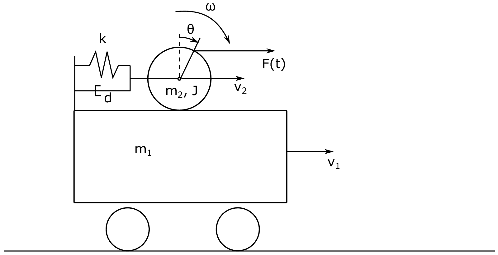

====================================
Assignment 10 - Advanced Bond Graphs
====================================

.. note::

    Submit your assignment as a single PDF, including plots and source code (if any).
    We expect academic honesty. Collaboration is encouraged, but must be declared. Any use of AI must be declared along with any other sources used.
    
    This is not an exam. Do your best and show that you put in effort and the assignment will be approved.

In this assignment we will consider the mechanical system shown in :numref:`assignment_10_system` first by using the procedure for modelling complex mechanical systems using bondgraphs descirbed in Pedersen and Engja, ch. 8.3, and then by means of an IC-field and Lagrange.

    Schematic drawing of the complex mechanical system.

The system consists of two masses. 
A wagon with mass :math:`m_1` rolling on mass-less wheels and a ball with mass :math:`m_2` free to roll on top of the wagon. 
The moment of inertia of the ball is :math:`J` .
The wagon and ball are connected through a spring and damper system with stiffness :math:`k` and linear damping coefficient :math:`d`.
The wagon speed is given by :math:`v_1` and the linear speed of the center of the ball is :math:`v_2`.
The angular velocity of the ball is :math:`\omega`.
The radius of the ball is :math:`r`.

Problem 1 - Basic approach
--------------------------

In this problem we will use the the procedure for modelling complex mechanical system in in Pedersen and Engja, ch. 8.3 to model the system.

.. admonition:: Tasks

    a. 
    
        Propose at least two feasible sets of generalized coordinates to describe the system. 
        The number of generalized coordinates should correspond to the number of degrees of freedoms in the system. 
        The wheel cannot slip on the wagon top.

    b. 
    
        The procedure tells us to identify the variables :math:`\dot{\boldsymbol{q}}_C` and :math:`\boldsymbol{v}_I`.
        Do this and express them in terms of the generalized coordinates :math:`\boldsymbol{q}_K` and :math:`\dot{\boldsymbol{q}}_K`. 
        Do not forget the externally applied force :math:`F(t)`. 

        .. hint:: 
            
            To apply the force, just establish an additional 1-junction that represents the linear velocity of the point where the force is applied in the direction of the force. 
            Place a 1-junction to represent this velocity and bond an effort source to it.

    c. 
    
        Make a bond graph of the system using the procedure mentioned above.

    d. 
    
        This bond graph is hard to take out equations from (in the sense that it involves a lot of algebra). 
        Why is this, and why do we get this problem?

Problem 2 - Alternative modelling assumptions
---------------------------------------------

As an alternative to struggling with the algebra, you just decided to instead change your model a bit (in fact make it more realistic).
Instead of assuming no slip of the wheel, we now allow the wheel to slip.
In practice such a model can be made to represent a no slip model by selecting a very large friction coefficient.

.. admonition:: Tasks

    a. 
    
        Make an updated bond graph for this model. 
        
        .. hint:: 
            
            To achieve this we need to adapt the model to include an extra degree of freedom. 
            Then we must bond an R-element to the velocity representing the different between the velocity of the ball relative to the wagon, and the velocity that the ball would have relative to the wagon if we had a no slip condition.

    b. 
    
        Assign causality and take out equations of motion for the system.

Problem 3 - Alternative implementation (Optional)
-------------------------------------------------

Up until now we have modelled the system, discovered that we get into some algebraic trouble due to differential causality, and instead of dealing with the algebraic loops, we have proceeded with an alternative approach, namely that of decoupling the linear and angular motion of the ball. 
We will now consider an alternative implementation where we keep the original assumption of no slip between the ball and its surface, and use Lagrange dynamics to help us resolve the differential causality. 
:numref:`assignment_10_ic` show how the system can be implemented as an IC-field. 
The constitutive relation for the IC-field is the generalized momentum state space form of the Lagrange equations. 
These are given as

.. math::

    \dot{\boldsymbol{q}}_K &= \boldsymbol{W}^{-1} \boldsymbol{p}_K
    \\
    \dot{\boldsymbol{p}}_K &= \frac{\partial L}{\partial \boldsymbol{q}_K}

where :math:`q_{K1}` and :math:`q_{K2}` are the two generalized coordinates, and :math:`L` is the Lagrangian (:math:`L = T - V`).

    
    IC-field implementation

.. admonition:: Tasks

    a. 
    
        Find the constitutive relation for the IC-field.

    b. 
    
        Include the applied force and damping from the damper between the ball and wagon to the bond graph in :numref:`assignment_10_ic`. 
        
        .. hint::
            
            If you cannot see directly how to connect the force, you can find an expression for the velocity in :math:`x`-direction of the point where the force is applied, place a 1-junction and relate it to the two existing 1-junctions, and bond an effort source to it. 
            Alternatively, you can calculate the generalized forces and apply them directly to the two existing 1-junctions through two effort sources.

    c. 
    
        Extract equations of motion from the bond graph.