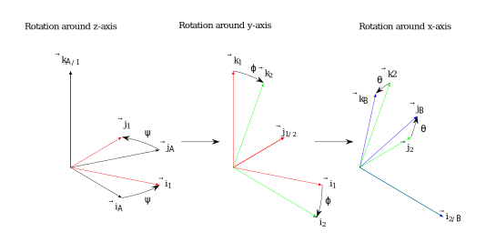

========================================
Assignment 3 - Kinematics Part 2
========================================

.. note::

    Submit your assignment as a single PDF, including plots and source code (if any).
    We expect academic honesty. Collaboration is encouraged, but must be declared. Any use of AI must be declared along with any other sources used.
    This is not an exam. Do your best and show that you put in effort and the assignment will be approved.

Problem 1 - Parameterizations of Rotations
===========================================

    ZYX Euler Angles as three successive rotations around the intermediate :math:`z`, :math:`y` and :math:`x` axes.

The ZYX Euler Angles is a parameterization of a rotation using three successive transformations around the intermediate :math:`z`, :math:`y` and :math:`x` axes (see :numref:`zyx-euler`). That is, the rotation matrix is given by

.. math::

   \mathbf{R}_{\mathcal{B}}^{\mathcal{A}}(\theta,\phi,\psi) = \mathbf{R}_z(\psi) \mathbf{R}_y(\phi) \mathbf{R}_x(\theta)

where :math:`\mathbf{R}_x`, :math:`\mathbf{R}_y`, and :math:`\mathbf{R}_z` represent the rotation matrix of the principal rotations around the :math:`z`, :math:`y` and :math:`x` axes, respectively.

.. math::

   \boldsymbol{\chi} =
   \begin{bmatrix}
       \theta \\
       \phi \\
       \psi
   \end{bmatrix}

are called the Euler Angles.

.. admonition:: Tasks

    a) Find the intermediate rotation matrices :math:`\mathbf{R}_{1}^{\mathcal{A}}`, :math:`\mathbf{R}_{2}^{1}`, and :math:`\mathbf{R}_{\mathcal{B}}^{2}` along with the relative angular velocities expressed in the local frame :math:`\boldsymbol{\omega}_{1/\mathcal{A}}^{\mathcal{A}}`, :math:`\boldsymbol{\omega}_{2/1}^{1}`, and :math:`\boldsymbol{\omega}_{\mathcal{B}/2}^{2}`.

    b) Show that the angular velocity of frame :math:`\mathcal{B}` with respect to :math:`\mathcal{A}` expressed in frame :math:`\mathcal{A}` is given by

    .. math::

       \boldsymbol{\omega}_{\mathcal{B}/\mathcal{A}}^{\mathcal{A}} = \mathbf{E} \dot{\boldsymbol{\chi}}

    where

    .. math::

       \mathbf{E} =
       \left[\begin{array}{ccc}
        \cos (\phi) \cos (\psi) & -\sin (\psi) & 0 \\
        \cos (\phi) \sin (\psi)  &\cos (\psi) & 0\\
        -\sin (\phi) & 0 & 1
       \end{array}\right]

    c) Show that the transformation :math:`\mathbf{E}` is singular at :math:`\phi = \frac{\pi}{2} + k\pi`, :math:`\forall k \in \mathbb{Z}`. Why does this make Euler Angles a bad choice when modelling rotating systems that can reach any orientation? What parameterization, which tackles this issue, is usually preferred?

Problem 2 - Pendulum on rotating disk
=========================================

   Pendulum on a rotating disk

The pendulum system shown in :numref:`Pendulum on a rotating disk` consists of a flat surface, a disk that can roll on the surface, and a pendulum attached to the rim of the disk.

We have attached an inertial reference frame :math:`\theta` such that the :math:`x_0`-axis is aligned with the surface. We also have a moving reference frame at the center of the wheel. This reference frame will rotate with the wheel. Finally, we have attached a third reference frame to the hinge point of the pendulum such that the :math:`y_3`-axis always remains aligned with the pendulum rod. Note that the angle :math:`\theta` of the pendulum rod is given in terms of an axis that remains horizontal. You can assume no slip between the rim and the surface.

.. hint::
    :class: dropdown

    Equations 6.409 and 6.410 at page 261 in :cite:t:`Egeland2002`, or Equations 60 and 77 in :cite:t:`lect2024`, might be useful.

.. admonition:: Tasks

    a) Find the linear (translational) velocity of point A. Your answer should be expressed in terms of the parameters of the system, and the variables :math:`\phi` and :math:`\theta` and their time derivatives.

    b) Find the linear acceleration of the point A of the parameters of the system, and the variables :math:`\phi` and :math:`\theta` and their first and second order time derivatives.

Problem 3 - Linked Mechanism
==============================

   Linked mechanism

The linked mechanism in :numref:`Linked Mechanism` consists of the two rigid bodies AB and BC. Body AB rotates about the :math:`z_0`-axis at a rate :math:`\dot{q}_1`, and body BC rotates about the :math:`y_2`-axis at the rate :math:`\dot{q}_2`. The :math:`z_0`-axis is parallel to the :math:`z_1`-axis. The :math:`y_2`-axis is parallel to the :math:`y_1`-axis.

.. hint::
    :class: dropdown

    Use `SymPy reference frames <https://docs.sympy.org/latest/modules/physics/vector/vectors.html#using-vectors-and-reference-frames>`_ to solve the following problems.

.. admonition:: Tasks

    a) Find the position of the points B and C relative to point A, expressed in terms of the reference frame :math:`x_0y_0z_0`. The positions should be expressed as functions of :math:`\boldsymbol{q} = [q_1,\, q_2]^T`.

    b) Find the angular velocity of the bodies AB and BC, expressed in terms of the reference frame :math:`x_0y_0z_0`.

    c) Find the linear velocity of the points B and C, expressed in terms of the reference frame :math:`x_0y_0z_0`.

    d) Express the linear velocity of point C in the form :math:`\boldsymbol{v}_C = \boldsymbol{J}(\boldsymbol{q})\dot{\boldsymbol{q}}`.
