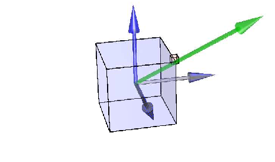

=============================
Assignment 4 - Newton-Euler
=============================

.. warning::

    The accompanying code for problem 1 is under development and will be released in time.

.. note::

    Submit your assignment as a single PDF, including plots and source code (if any).
    We expect academic honesty. Collaboration is encouraged, but must be declared. Any use of AI must be declared along with any other sources used.
    This is not an exam. Do your best and show that you put in effort and the assignment will be approved.

This assignment is about the Newton-Euler method for developing a dynamic model of a mechanical system. This topic is treated in :cite:t:`Egeland2002` from chapter 6.13 to 7.3.

Problem 1 - Satellite
===========================

In this task, we will consider a satellite orbiting Earth. We define an inertial reference frame with its origin at Earth's center and with an arbitrary and fixed orientation.

We will consider two cases:

1. The satellite is a cube of uniform, unitary density, having an edge of :math:`50\ cm`.
2. The satellite is the cube mentioned above, with the addition of a punctual mass of :math:`m_o = 0.1\ kg` placed at one of the cube's corners.

   Schematic of the satellite.

We will assume that the force of gravity is given by Newton's law of universal gravitation:

.. math::
    :label: newton

    \vec{F} = - \frac{G\,m_\mathrm{T}\,m}{\|\vec r_\mathrm{c}\|^2} \cdot \frac{\vec r_\mathrm{c}}{\|\vec r_\mathrm{c}\|}

The inertia matrix in the reference frame attached to the cube with its origin at the cube's center of mass and with the axes going through the center of the cube's faces is given by

.. math::
    :label: inertia-matrix

    \frac{1}{6}ml^2 I

where `m` is the mass, `l` is the length of the sides, and `I` is the 3-by-3 identity matrix.

This exercise is about dynamics, but we still have to parameterize the kinematics of the satellite.

We will describe the satellite's position by a vector from the world center to the satellite's center of mass given in the inertia frame :math:`\mathbf{r}_c^i`, and the orientation by the unit quaternion :math:`\mathbf{q}` corresponding to the rotation between the inertial and body frame, :math:`\mathbf{R}_b^i`.

.. math::

    \mathbf{q} \triangleq \left[ \begin{array}{l}
    q_w \\
    \mathbf{q}_v
    \end{array} \right] = \left[ \begin{array}{l}
    q_w \\
    q_x \\
    q_y \\
    q_z
    \end{array} \right]

The kinematics are given by:

.. math::

    \dot{\mathbf{r}}_c^i = \mathbf{v}_c^i

.. math::

    \dot{\mathbf{q}} = \frac{1}{2} \mathbf{q} \otimes \boldsymbol{\omega}_{b/i}^b = \frac{1}{2} \boldsymbol{\Omega}(\boldsymbol{\omega}_{b/i}^b) \mathbf{q}

Where :math:`\mathbf{v}_c^i` is the velocity of the center of mass given in the inertial frame, :math:`\boldsymbol{\omega}_{b/i}^b` is the angular velocity of the satellite given in the body frame, and :math:`\boldsymbol{\Omega}(\boldsymbol{\omega})` is defined as:

.. math::

    \boldsymbol{\Omega}(\boldsymbol{\omega}) \triangleq [\boldsymbol{\omega}]_R = \left[ \begin{array}{cc}
    0 & -\boldsymbol{\omega}^{\top} \\
    \boldsymbol{\omega} & -[\boldsymbol{\omega}]_{\times}
    \end{array} \right] = \left[ \begin{array}{cccc}
    0 & -\omega_x & -\omega_y & -\omega_z \\
    \omega_x & 0 & \omega_z & -\omega_y \\
    \omega_y & -\omega_z & 0 & \omega_x \\
    \omega_z & \omega_y & -\omega_x & 0
    \end{array} \right]

.. hint::
    :class: dropdown

    You will find Python code templates / examples on Blackboard to help you get started. Further hints are provided therein. You have to edit `Satellite3DTemplate.py` and `SatelliteDynamics.py` in order for the code to run. The entry point of the code is the former file.

.. admonition:: Tasks

    a) Consider the satellite without the added mass. Use the Newton-Euler equations to derive the dynamics of the satellite, i.e., find expressions for :math:`\mathbf{v}_c^i` and :math:`\boldsymbol{\omega}_b^i`.

    b) Now consider the added mass (case 2 above). The added mass will shift the center of mass of the system. Calculate the inertia matrix around this new center of mass and find the updated expressions for :math:`\mathbf{v}_c^i` and :math:`\boldsymbol{\omega}_b^i`.

    .. hint::

        Use the parallel axis theorem to find the new inertia matrix.

    c) Simulate the two cases in parts 1 and 2. What differences do you observe?

Problem 2 - Pendulum on an oscillator
==========================================

.. figure:: figures/pendulum_osc.svg
    :width: 30%
    :name: pendulum

    Pendulum on a vertical oscillator

:numref:`pendulum` shows a pendulum with a point mass :math:`m_2` attached to a mass :math:`m_1` that can oscillate along a vertical axis. The pendulum rod has a length :math:`L` and the rod can be considered mass-less (i.e. the pendulum can be considered as a point mass at the end of a mass-less rod).

The oscillating mass is connected to a stationary construction through a spring with stiffness :math:`k`. The vertical position :math:`z` of the mass is defined such that :math:`z_0` when the spring is in its neutral position. The angular displacement of the pendulum rod is :math:`\theta`, as shown in the figure. For simplicity we also constrain body one to only move up or down, i.e no movement along the :math:`\text{y}_0` or :math:`\text{z}_0` axis.

.. admonition:: Tasks

    **a. Kinematics**

    We will start by expressing the kinematics of the system. Show that the acceleration of the COMs, :math:`\mathbf{\vec{a}}_1` and :math:`\mathbf{\vec{a}}_2` and the angular acceleration of body 2, :math:`\mathbf{\vec{\alpha}}`, is given by:

    .. math::

       \mathbf{a}_1 = \ddot{z} \mathbf{k}_0

    .. math::

       \mathbf{a}_2 = \left(L\ddot{\theta}\cos\theta - L\dot{\theta}^2\sin\theta\right) \mathbf{j}_0 + \left(\ddot{z} + L\dot{\theta}^2\cos\theta + L\ddot{\theta}\sin\theta\right)\mathbf{k}_0

    .. math::

       \mathbf{\alpha} = \ddot{\theta} \mathbf{i}_0

    **b. Newton Euler equations**

    Show that the Newton Euler equations for the two rigid bodies are given by:

    .. math::

       m_1 \mathbf{a}_1 = \mathbf{F}_{\text{spring}} + \mathbf{F}_{g1} + \mathbf{F}_{\text{joint}}

    .. math::

       m_2 \mathbf{a}_2 = \mathbf{F}_{g2} + \mathbf{F}_{\text{joint}}

    .. math::

       \mathbf{r}_{2/1} \times m_2 \mathbf{a}_2 = \boldsymbol{\tau}_{g2}

    Where :math:`\mathbf{F}_{\text{spring}}` is the force acting from the spring, :math:`\mathbf{F}_{g1}` and :math:`\mathbf{F}_{g2}` are the gravitational forces acting on mass 1 and 2, :math:`\boldsymbol{\tau}_{g2}` is the torque induced by :math:`\mathbf{F}_{g2}` acting around the origin of frame 1, and :math:`\mathbf{F}_{\text{joint}}` is the joint force keeping the two bodies together.

    **c. Equation of motion**

    Using the results from part a and b, show that the equation of motion can be expressed as:

    .. math::

       (m_1+m_2)\ddot{z} + m_2 L \dot{\theta}^2 \cos\theta + m_2 L \ddot{\theta} \sin\theta + (m_1+m_2)g + kz = 0

    .. math::

       L^2 m_2 \ddot{\theta} + L m_2 \ddot{z} \sin\theta + L m_2 g \sin\theta = 0

    .. hint::

        Since the oscillating mass is constrained to move along the :math:`\text{z}_0` axis, this makes some simplifications to equations :eq:`newton` and :eq:`inertia-matrix`.

    **d. Modeling with uniformly distributed mass**

    Assume now that we were to remove the point mass :math:`m_2`, and instead model the pendulum as a rod with uniformly distributed mass :math:`m_2` with center of gravity at the midpoint of the rod, such that the moment of inertia about the center point is :math:`I_{xx} = \frac{L^2 m_2}{12}`. What are the equations of motion now?

    **e. Parallel Axis Theorem**

    In some cases, when dealing with moment balances of rigid bodies that are rotating about some point that is not their center of gravity, we may modify the moment of inertia expression by employing the parallel axis theorem. This adjustment allows us to simplify the modeling of motion as a pure rotation.

    Why can we not simply use the parallel axis theorem in Task b) above, and model the pendulum as a pure rotation about the hinge point of the rod? What term would be missing in the model you derived in Task b)?

