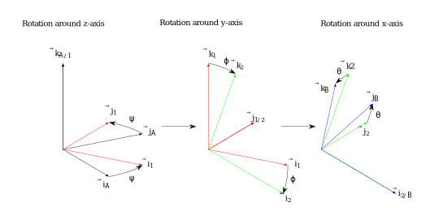

========================================
Assignment 4 - Kinematics
========================================

Problem 1 - Rotation transformations in 2D
==========================================

In this problem, we will study coordinate transformation in the two reference frames shown (in terms of their unit vectors) in the figure below.

.. figure:: figures/ned_and_ship_frames.svg
   :scale: 60%
   :align: center

   The orientation of the unit vectors of the NED-frame and the :math:`s`-frame.

.. admonition:: Tasks

    a) Express the unit vectors :math:`\mathbf{i_s}` and :math:`\mathbf{j_s}` of the :math:`s`-frame in terms of the unit vectors :math:`\mathbf{i_N}` and :math:`\mathbf{j_N}` of the NED-frame. Refer to the figure above for support.

    b) Consider a vector

       .. math::

          \mathbf{v} = \xi_1 \mathbf{i_s} + \xi_2 \mathbf{j_s}

       This vector can also be expressed through the unit vectors of the NED-frame as :math:`\mathbf{v} = \chi_1 \mathbf{i_N} + \chi_2 \mathbf{j_N}`. Your task is to express :math:`\chi_1` and :math:`\chi_2` as functions of :math:`\xi_1`, :math:`\xi_2`, and :math:`\psi`.

    c) A more compact and practical way of transforming the coordinates of vectors between the component directions of the two reference frames (NED-frame and :math:`s`-frame) is to use coordinate vector notation and rotation matrices. Based on the results from the previous task, find the 2×2 matrix :math:`\mathbf{R}^N_s(\psi)` that is defined such that

       .. math::

          \mathbf{v}^N =
          \begin{bmatrix} \chi_1 \\ \chi_2 \end{bmatrix}
          = \mathbf{R}^N_s(\psi)
          \begin{bmatrix} \xi_1 \\ \xi_2 \end{bmatrix}
          = \mathbf{R}^N_s(\psi) \mathbf{v}^s

Problem 2 - Barge with crane
=============================

:numref:`fig:lekter` shows a barge located some distance from a stationary platform. The stationary platform has a fixed reference frame attached to it, referred to as the NED-frame (for North, East, Down), whose axes are pointing northwards, eastwards, and downwards toward the center of the Earth.

.. _fig:lekter:

   A barge with a crane.

We also attach a reference system :math:`x_s, y_s, z_s` (i.e., the :math:`s`-frame) to the barge, as shown in the figure. The z-axis is pointing downwards in accordance with the right-hand rule. The location of the origin of the :math:`s`-frame relative to the origin of the NED-frame is given as:

.. math::

    \mathbf{r}_{s/n} = n \mathbf{i}_{n} + e \mathbf{j}_{n} + d \mathbf{k}_{n}

The position of the crane on the barge is given as:

.. math::

    \mathbf{r}_{c/s} = a \mathbf{i}_{s} + b \mathbf{j}_{s} + c \mathbf{k}_{s}

The angle between the :math:`x_s`-axis and the :math:`x_c`-axis is :math:`\alpha`.

Finally, the distance from the origin of the crane-fixed reference frame to the tip of the crane is :math:`l`.

.. note::

   When we ask for a vector in this problem, your answer should be in the form:

   .. math::

      \mathbf{r} = g \mathbf{i}_{k} + h \mathbf{j}_{k}

   or:

   .. math::

      \mathbf{r}^k =  \begin{bmatrix} g \\ h \end{bmatrix}

   where we need expressions for :math:`g` and :math:`h`.

   **The expressions should be formulated in terms of the parameters** :math:`(a, b, c, l)` **, the variables** :math:`(\psi, \alpha, n, e, d)` **and their time derivatives** :math:`(\dot{\psi}, \dot{\alpha}, \dot{n}, \dot{e}, \dot{d})`.

.. admonition:: Tasks

    a) Find an expression for the position of the origin of the barge-fixed reference frame relative to the origin of the NED-frame expressed in terms of the barge-fixed reference frame.

    b) Find an expression for the position of the tip of the crane relative to the origin of the :math:`s`-frame as a function of :math:`\alpha`. Express the vector in terms of the :math:`s`-frame.

    c) Find an expression for the position of the tip of the crane relative to the origin of the NED-frame. Express the vector in terms of the NED-frame.

    d) What is the angular velocity of the crane when the barge has a turn rate of :math:`\dot{\psi}` and the crane base is rotating at the rate :math:`\dot{\alpha}`?

    e) The vessel has a forward velocity :math:`u` and a sideways velocity of :math:`v` relative to the inertial reference frame (the NED-frame). Find expressions for :math:`\dot{n}` and :math:`\dot{e}` (i.e., the time derivatives of the components in the equation above).

    f) What is the linear velocity of the crane tip? The vessel still moves with a forward velocity component :math:`u` and a sideways velocity component :math:`v`, and in addition, it has an angular speed of magnitude :math:`\dot{\psi}`. The crane has an angular speed with magnitude :math:`\dot{\alpha}`. You can express the answer in terms of the NED-frame.

Problem 3 - Parameterizations of Rotations
===========================================

    ZYX Euler Angles as three successive rotations around the intermediate :math:`z`, :math:`y` and :math:`x` axes.

The ZYX Euler Angles is a parameterization of a rotation using three successive transformations around the intermediate :math:`z`, :math:`y` and :math:`x` axes (see :numref:`zyx-euler`). That is, the rotation matrix is given by

.. math::

   \mathbf{R}_{\mathcal{B}}^{\mathcal{A}}(\theta,\phi,\psi) = \mathbf{R}_z(\psi) \mathbf{R}_y(\phi) \mathbf{R}_x(\theta)

where :math:`\mathbf{R}_x`, :math:`\mathbf{R}_y`, and :math:`\mathbf{R}_z` represent the rotation matrix of the principal rotations around the :math:`z`, :math:`y` and :math:`x` axes, respectively.

.. math::

   \boldsymbol{\chi} =
   \begin{bmatrix}
       \theta \\
       \phi \\
       \psi
   \end{bmatrix}

are called the Euler Angles.

.. admonition:: Tasks

    a) Find the intermediate rotation matrices :math:`\mathbf{R}_{1}^{\mathcal{A}}`, :math:`\mathbf{R}_{2}^{1}`, and :math:`\mathbf{R}_{\mathcal{B}}^{2}` along with the relative angular velocities expressed in the local frame :math:`\boldsymbol{\omega}_{1/\mathcal{A}}^{\mathcal{A}}`, :math:`\boldsymbol{\omega}_{2/1}^{1}`, and :math:`\boldsymbol{\omega}_{\mathcal{B}/2}^{2}`.

    b) Show that the angular velocity of frame :math:`\mathcal{B}` with respect to :math:`\mathcal{A}` expressed in frame :math:`\mathcal{A}` is given by

    .. math::

       \boldsymbol{\omega}_{\mathcal{B}/\mathcal{A}}^{\mathcal{A}} = \mathbf{E} \dot{\boldsymbol{\chi}}

    where

    .. math::

       \mathbf{E} =
       \left[\begin{array}{ccc}
        \cos (\phi) \cos (\psi) & -\sin (\psi) & 0 \\
        \cos (\phi) \sin (\psi)  &\cos (\psi) & 0\\
        -\sin (\phi) & 0 & 1
       \end{array}\right]

    c) Show that the transformation :math:`\mathbf{E}` is singular at :math:`\phi = \frac{\pi}{2} + k\pi`, :math:`\forall k \in \mathbb{Z}`. Why does this make Euler Angles a bad choice when modelling rotating systems that can reach any orientation? What parameterization, which tackles this issue, is usually preferred?

Problem 4 - Linked Mechanism
==============================

.. figure:: figures/mechanism.svg
   :align: center
   :scale: 100%
   :name: Linked mechanism

   Linked mechanism

The linked mechanism in :numref:`Linked Mechanism` consists of the two rigid bodies AB and BC. Body AB rotates about the :math:`z_0`-axis at a rate :math:`\dot{q}_1`, and body BC rotates about the :math:`y_2`-axis at the rate :math:`\dot{q}_2`. The :math:`z_0`-axis is parallel to the :math:`z_1`-axis. The :math:`y_2`-axis is parallel to the :math:`y_1`-axis.

.. hint::
    :class: dropdown

    Use `SymPy reference frames <https://docs.sympy.org/latest/modules/physics/vector/vectors.html#using-vectors-and-reference-frames>`_ to solve the following problems.

.. admonition:: Tasks

    a) Find the position of the points B and C relative to point A, expressed in terms of the reference frame :math:`x_0y_0z_0`. The positions should be expressed as functions of :math:`\boldsymbol{q} = [q_1,\, q_2]^T`.

    b) Find the angular velocity of the bodies AB and BC, expressed in terms of the reference frame :math:`x_0y_0z_0`.

    c) Find the linear velocity of the points B and C, expressed in terms of the reference frame :math:`x_0y_0z_0`.

    d) Express the linear velocity of point C in the form :math:`\boldsymbol{v}_C = \boldsymbol{J}(\boldsymbol{q})\dot{\boldsymbol{q}}`.

Problem 5 (optional) - Pendulum on rotating disk
================================================

.. figure:: figures/pendulum_on_disk.svg
   :width: 60%
   :align: center
   :name: Pendulum on a rotating disk

   Pendulum on a rotating disk

The pendulum system shown in :numref:`Pendulum on a rotating disk` consists of a flat surface, a disk that can roll on the surface, and a pendulum attached to the rim of the disk.

We have attached an inertial reference frame :math:`\theta` such that the :math:`x_0`-axis is aligned with the surface. We also have a moving reference frame at the center of the wheel. This reference frame will rotate with the wheel. Finally, we have attached a third reference frame to the hinge point of the pendulum such that the :math:`y_2`-axis always remains aligned with the pendulum rod. Note that the angle :math:`\theta` of the pendulum rod is given in terms of an axis that remains horizontal. You can assume no slip between the rim and the surface.

.. hint::
    :class: dropdown

    Equations 6.409 and 6.410 at page 261 in :cite:t:`Egeland2002`, or Equations 60 and 77 in :cite:t:`lect2024`, might be useful.

.. admonition:: Tasks

    a) Find the linear (translational) velocity of point A. Your answer should be expressed in terms of the parameters of the system, and the variables :math:`\phi` and :math:`\theta` and their time derivatives.

    b) Find the linear acceleration of the point A of the parameters of the system, and the variables :math:`\phi` and :math:`\theta` and their first and second order time derivatives.