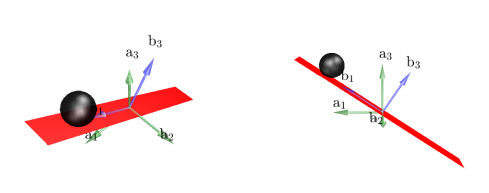

=========================
Assignment 6 - Lagrange
=========================

.. note::

    Submit your assignment as a single PDF, including plots and source code (if any).
    We expect academic honesty. Collaboration is encouraged, but must be declared. Any use of AI must be declared along with any other sources used.
    This is not an exam. Do your best and show that you put in effort and the assignment will be approved.

In this assignment we will study the modeling of complex mechanical systems based on the Lagrange approach.

Problem 1 - Ball on a Beam
==========================

.. note::

    This problem contains a programming exercise.
    Template code is available as a Jupyter notebook at `<https://github.com/TTK4130/code-handouts>`_.
    The relevant notebook is `assingment-5-ball-and-beam.ipynb`.

.. admonition:: Animation code
    :class: dropdown

    .. jupyter-execute::

        import pythreejs as pj
        import numpy as np
        import requests
        import base64

        def load_image_from_url(url):
            response = requests.get(url)
            if response.status_code == 200:
                return f"data:image/png;base64,{base64.b64encode(response.content).decode('utf-8')}"
            else:
                raise Exception(f"Failed to load image from {url}")

        # Cubemap texture URLs, because I'm lazy
        texture_urls = [
            "https://raw.githubusercontent.com/TTK4130/ttk4130.github.io/refs/heads/main/docs/_static/ceiling_lights_cubemap/px.png",  # Positive X
            "https://raw.githubusercontent.com/TTK4130/ttk4130.github.io/refs/heads/main/docs/_static/ceiling_lights_cubemap/nx.png",  # Negative X
            "https://raw.githubusercontent.com/TTK4130/ttk4130.github.io/refs/heads/main/docs/_static/ceiling_lights_cubemap/py.png",  # Positive Y
            "https://raw.githubusercontent.com/TTK4130/ttk4130.github.io/refs/heads/main/docs/_static/ceiling_lights_cubemap/ny.png",  # Negative Y
            "https://raw.githubusercontent.com/TTK4130/ttk4130.github.io/refs/heads/main/docs/_static/ceiling_lights_cubemap/pz.png",  # Positive Z
            "https://raw.githubusercontent.com/TTK4130/ttk4130.github.io/refs/heads/main/docs/_static/ceiling_lights_cubemap/nz.png"   # Negative Z
        ]

        scene = pj.Scene()
        camera = pj.PerspectiveCamera(position=[0, 0, 5], up=[0, 1, 0], aspect=1)
        camera.lookAt([0, 0, 0])

        skybox_geometry = pj.BoxGeometry(width=500, height=500, depth=500)

        materials = [
            pj.MeshBasicMaterial(
                map=pj.ImageTexture(imageUri=load_image_from_url(url)),
                side='BackSide'
            ) for url in texture_urls
        ]
        skybox = pj.Mesh(skybox_geometry, materials)
        scene.add(skybox)

        ## Placeholder trajectory

        ys = np.zeros((4, 100), dtype=np.float32)
        ts = np.zeros((1, 100), dtype=np.float32)

        ## Setting up objects
        ball_radius = 0.25
        beam_length, beam_width, beam_height = 3, .5, .1

        ball = pj.Mesh(
            pj.SphereGeometry(ball_radius, 32, 16),
            pj.MeshStandardMaterial(color="blue"))
        beam = pj.Mesh(
            pj.BoxGeometry(beam_length, beam_height, beam_width),
            pj.MeshStandardMaterial(color="red"))

        ## Position and rotation
        ball_pos = np.zeros((3, ys.shape[1]), dtype=np.float32)
        ball_pos[0, :] = ys[0, :]
        ball_pos[1, :] = (ball_radius + 0.5 * beam_height) * np.ones((len(ts)))

        from scipy.spatial.transform import Rotation
        exaggeration_coefficient = 10
        beam_rot = Rotation.from_euler("z", exaggeration_coefficient * ys[1, :], degrees=True).as_quat().astype(np.float32).T

        beam.position = (0, 0, 0)
        ball.position = tuple(ball_pos[:, 0])

        ## Collecting in a group for correct rotation animation
        pivot = pj.Group()
        pivot.add(beam)  # this becomes pivot.children[0]
        pivot.add(ball)  # this becomes pivot.children[1]
        pivot.quaternion = tuple(beam_rot[:, 0])
        scene.add(pivot)

        ## Setting up the animation
        ball_position_track = pj.VectorKeyframeTrack(name=".children[1].position", times = ts, values = ball_pos.T)
        pivot_rotation_track = pj.QuaternionKeyframeTrack(name=".quaternion", times = ts, values = beam_rot.T)
        pivot_clip = pj.AnimationClip(tracks = [ball_position_track, pivot_rotation_track])
        pivot_action = pj.AnimationAction(pj.AnimationMixer(pivot), pivot_clip, pivot)

        ## Setting the scene
        view_width, view_height = 800, 600
        camera = pj.PerspectiveCamera(position=[0, 1, 4], aspect = view_width/view_height)
        ambient_light = pj.AmbientLight(color="#ffffff", intensity=1.0)
        key_light = pj.DirectionalLight(position=[0, 10, 0])
        scene.add(ambient_light)
        scene.add(key_light)

        ## Making the renderer
        controls = pj.OrbitControls(controlling = camera)
        renderer = pj.Renderer(camera=camera, scene=scene, width=view_width, height=view_height, controls=[controls])

.. jupyter-execute::

    renderer

.. jupyter-execute::

    pivot_action

We consider here a solid ball on a beam system as depicted in :numref:`bob`.
The ball rolls without slipping (pure rotation) on a beam that is articulated without friction in the middle.
A torque :math:`T` acts on the beam joint.
We will use the following numerical values: The rotational inertia of the rail around its joint is :math:`J = 1\ \text{kg} \cdot \text{m}^2`, the mass of the ball is :math:`M = 10\ \text{kg}` and its radius is :math:`R = 0.25\ \text{m}`.
The position of the ball with respect to the joint of the rail will be labeled by :math:`x`.

A rotation with :math:`\dot{\theta}>0` obeys the right-hand rule for reference frames :math:`\mathbf{a}` and :math:`\mathbf{b}`, while a displacement with :math:`\dot{x}>0` moves the ball in the direction :math:`\mathbf{b}_1` (see :numref:`bob`).

Here, we will use the generalized coordinates :math:`\mathbf{q} = [x,\,\theta]^T`.

    Schematic of the ball on a beam.

.. admonition:: Tasks

    a) What is the position of the ball's center as a function of the generalized coordinates?

    b) The total movement of the ball is the result of its movement with respect to the beam, in addition to the movement of the beam.

       What is then the angular velocity of the ball as a function of the generalized coordinates?

    c) The ball is a rigid body that both experiences translation and rotation.

       What is the expression for the kinetic energy of the ball?

    d) The beam is also a rigid body, but it only rotates.

       What is the expression for the kinetic energy of the beam?

    e) Complete the Jupyter notebook `assingment-5-ball-and-beam.ipynb` (found in the `code handout repository <https://github.com/TTK4130/code-handouts>`_) by doing the following tasks:

       - Define the generalized coordinates :math:`\mathbf{q} = [x,\,\theta]^T` as a symbolic variable.
       - Define a symbolic variable for the derivative of the generalized coordinates.
       - Write the expression for the position of the ball's center.
       - Complete the expressions for the kinetic and potential energies.
       - Write the expression for the Lagrangian function.
       - Run the routine.

       Add the implemented code to your answer.

       The Lagrange equations can be written in state-space form as given by

       .. math::

          \mathbf{x} = \begin{bmatrix} \mathbf{q} \\ \dot{\mathbf{q}} \end{bmatrix},\qquad \dot{\mathbf{x}} = \begin{bmatrix} \dot{\mathbf{q}} \\  \left(\frac{\partial^2 \mathcal{L}}{\partial \dot{\mathbf{q}}^2}\right)^{-1}\left(\mathbf{Q} + \frac{\partial \mathcal{L}}{\partial \mathbf{q}} - \frac{\partial^2 \mathcal{L}}{\partial \dot{\mathbf{q}} \partial \mathbf{q}} \dot{\mathbf{q}} \right) \end{bmatrix}.

       The routine implemented in part (e) exports two Matlab functions.
       One that gives the position of the ball's center, while the other returns the terms :math:`\frac{\partial^2 \mathcal{L}}{\partial \dot{\mathbf{q}}^2}` and :math:`\mathbf{Q} + \frac{\partial \mathcal{L}}{\partial \mathbf{q}} - \frac{\partial^2 \mathcal{L}}{\partial \dot{\mathbf{q}} \partial \mathbf{q}} \dot{\mathbf{q}}`.

    f) Assume that the external torque :math:`T` is given by the PD control law:

       .. math::
            :label: ODE

            T = 200 (x-\theta) + 70 (\dot{x} - \dot{\theta})

       Write a function that gives the dynamics of the state-space model :eq:`ODE` by using the `get_W` and `get_RHS` functions and the PD control law.
       In other words, this function should return the value of the right-hand side of :eq:`ODE` as a function of the states and the parameters.

    g) **(Optional task)** Complete the delivered Jupyter notebook in order to make an animation of the simulation results.

       Simulate your system using e.g. :math:`x(0) = 1,\, \theta(0) = 0` as initial conditions with initial velocities at rest.

       Run the animation.

       What do you observe? Are these results reasonable? Explain.

       *Hint: The function that returns the position of the ball's center can come in handy here.*

Problem 2 - Pendulum on a Vertical Oscillator
==============================================

In this problem, we will derive equations of motion for the same system analyzed in Assignment 4. Previously, we used the Newton-Euler approach; now, we will use the Lagrange method. Depending on your choice of generalized coordinates, you may obtain the same equations as in Assignment 4.

   Pendulum on a vertical oscillator

Figure above shows a pendulum with a point mass :math:`m_2` attached to a mass :math:`m_1` that can oscillate along a vertical axis. The pendulum rod has a length :math:`L` and is considered massless (i.e., the pendulum can be modeled as a point mass at the end of a massless rod).

The oscillating mass is connected to a stationary structure via a spring with stiffness :math:`k`. The vertical position :math:`z` of the mass is defined such that :math:`z_0` corresponds to the neutral position of the spring. The angular displacement of the pendulum rod is :math:`\theta`, as indicated in the figure. For simplicity, body one is constrained to move only along the vertical axis, with no motion along the :math:`y_0` or :math:`z_0` directions.

.. admonition:: Tasks

    a) Select a set of generalized coordinates that uniquely describe the configuration of the system. Ensure the number of coordinates corresponds to the degrees of freedom of the system.

    b) Find the kinetic energy of the system and express it in terms of the generalized coordinates and their time derivatives.

    c) Find the potential energy of the system and express it in terms of the generalized coordinates.

    d) Derive the equations of motion for the system using the Lagrange method.

    **Hints:**

    - Express the coordinates of both masses in terms of the generalized coordinates before differentiating.
    - Consider the contributions to the kinetic and potential energy separately for each mass.
    - Apply the Euler-Lagrange equation to derive the equations of motion:

      .. math::
          \frac{d}{dt} \left( \frac{\partial T}{\partial \dot{q}_i} \right) - \frac{\partial T}{\partial q_i} + \frac{\partial V}{\partial q_i} = 0

