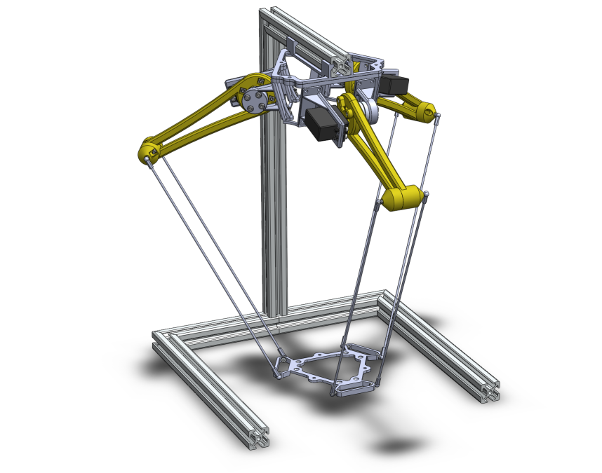

===================================
Assignment 7 - Constrained Lagrange
===================================

.. note::

    Submit your assignment as a single PDF, including plots and source code (if any).
    We expect academic honesty. Collaboration is encouraged, but must be declared. Any use of AI must be declared along with any other sources used.
    This is not an exam. Do your best and show that you put in effort and the assignment will be approved.

In this assignment we will study the modeling of complex mechanical systems using the constrained Lagrange equations.
Since the calculations of the partial derivatives of the Lagrangian can be involved, we will once more outsource this task by using SymPy.

Problem 1 - Hovering Mass
--------------------------

.. note::

    This problem contains a programming exercise.
    Template code is available as a Jupyter notebook at `<https://github.com/TTK4130/code-handouts>`_.
    The relevant notebook is `assingment-6-hovering-mass.ipynb`.

We consider a helicopter lifting a mass. We model this system as two point masses coupled by a rigid link with length :math:`L`. The masses are :math:`m_1` and :math:`m_2`, and their positions in space are given by :math:`\mathbf{p}_1 \in \mathbb{R}^3` and :math:`\mathbf{p}_2 \in \mathbb{R}^3`. We assume that an external force :math:`\mathbf{u} \in \mathbb{R}^3` is applied to :math:`m_1` (helicopter).

.. admonition:: a. Classical Lagrange Approach

    We will first model this system using the classical Lagrange approach, where the number of coordinates equals the number of degrees of freedom. The position of the helicopter is described by :math:`\mathbf{p}_1 \in \mathbb{R}^3`, and the position of the hovering mass is described by the two angles :math:`\theta, \phi`, which give the orientation of the rigid link (spherical coordinates). Hence, the generalized coordinates are:

    .. math::
        \mathbf{q} = \begin{bmatrix} \mathbf{p}_1 \\ \theta \\ \phi \end{bmatrix} \in \mathbb{R}^5.

    The fully assembled model takes the form:

    .. math::
        \begin{aligned}
            \dot{\mathbf{q}} &= \mathbf{v},\\
            M(\mathbf{q})\dot{\mathbf{v}} &= \mathbf{b}(\mathbf{q},\dot{\mathbf{q}},\mathbf{u}).
        \end{aligned}

    Complete the template `assingment-6-hovering-mass.ipynb` (found in the `code handout repository <https://github.com/TTK4130/code-handouts>`_) by performing the following tasks:

    1. Write the expression for the position :math:`\mathbf{p}_2` of mass :math:`m_2` from :math:`\mathbf{q}`.
    2. Write the expression for the generalized forces.
    3. Write the expression for the kinetic energy.
    4. Write the expression for the potential energy.
    5. Write the expression for the Lagrangian.
    6. Run the routine to obtain the expressions for :math:`M` and :math:`\mathbf{b}`.

    Include the equations and the implemented code in your answer.

.. admonition:: b. Constrained Lagrange Approach

    We now use the constrained Lagrange approach to model the system dynamics. The generalized coordinates in this case are:

    .. math::

        \mathbf{q} = \begin{bmatrix} \mathbf{p}_1 \\ \mathbf{p}_2 \end{bmatrix} \in \mathbb{R}^6,

    and the scalar constraint is given by:

    .. math::

        C = \frac{1}{2} \left( \mathbf{e}^\top \mathbf{e} - L^2 \right), \quad \text{where} \quad \mathbf{e} = \mathbf{p}_1 - \mathbf{p}_2.

    The system dynamics are:

    .. math::

        \begin{aligned}
            \frac{\mathrm{d}}{\mathrm{d}t} \frac{\partial \mathcal{L}}{\partial \dot{\mathbf{q}}}(\mathbf{q},\dot{\mathbf{q}}) - \frac{\partial \mathcal{L}}{\partial \mathbf{q}}(\mathbf{q},\dot{\mathbf{q}}) - z \nabla C(\mathbf{q}) &= \mathbf{Q},\\
            C(\mathbf{q}) &= 0.
        \end{aligned}

    The fully assembled model takes the form:

    .. math::

        \begin{aligned}
            \dot{\mathbf{q}} &= \mathbf{v},\\
            M(\mathbf{q}) \dot{\mathbf{v}} &= \mathbf{b}(\mathbf{q},\mathbf{z},\mathbf{u}),\\
            0 &= C(\mathbf{q}).
        \end{aligned}

    Perform the following tasks:

    1. Derive the model matrices :math:`M(\mathbf{q})` and :math:`\mathbf{b}(\mathbf{q}, \dot{\mathbf{q}}, \mathbf{u})`.
    2. Compare the complexity of the models from part (a) and (b) in terms of symbolic expressions for :math:`M` and :math:`\mathbf{b}`. What do you conclude?

Problem 2 - Delta-Robot
-----------------------

Delta-robots are common in ultra-fast packaging applications.
Figure :numref:`fig-system` illustrates a Delta-robot.
The three yellow arms of length :math:`l` are actuated and can pivot in their vertical planes.
These arms drive the three double thin rods of length :math:`L` (typically made of ultra-light carbon fiber), connected to the nacelle (triangular shape at the bottom).
The geometry imposes that the nacelle always remains horizontal.
Moreover, the pivots on the nacelle are forced to remain at a distance :math:`L` from the pivot at the extremities of the yellow arms.

In order to express the Lagrange function and the constraints, the following parameters and variables are defined:
The Cartesian frame has its origin at the center of the upper platform, with the :math:`x`-axis aligned with the frontal robot arm, and the :math:`z`-axis pointing up.
The position of the pivots of the yellow arms in this Cartesian frame, :math:`\mathbf{p}_{1,2,3}`, are given by

.. math::
   \mathbf{p}_k= R_k\begin{bmatrix}d+l\cos\alpha_k \\ 0 \\ -l\sin\alpha_k \end{bmatrix},\quad R_k = \begin{bmatrix}\cos \gamma_k & -\sin\gamma_k & 0 \\
   \sin \gamma_k & \cos\gamma_k & 0 \\
   0 & 0 & 1\end{bmatrix},

where :math:`\gamma_{1,2,3} = \left\{0, \frac{2\pi}{3},\frac{4\pi}{3}\right\}`, :math:`d` is the constant distance from the center of the upper platform to the axis of the motors (black in the figure), and :math:`\alpha_k` are the angles of the yellow arms with respect to the horizontal plane.
The yellow arms together with the motors have an inertia :math:`J`, i.e. their kinetic energy is :math:`T_k = \frac{1}{2}J\dot\alpha_k^2`.
The nacelle has a mass :math:`m`.
For simplicity, we will assume that the nacelle is just a point where the long arms are all connected. This is a simplification.

   Illustration of the Delta-robot. The yellow arms (length :math:`l`) are actuated by the motors on the upper platform (black boxes).

.. admonition:: Tasks

    **a. Classical Unconstrained Lagrange Approach**

    Assume that we use the classical unconstrained Lagrange approach with the angles :math:`\alpha_{1,2,3}` as the generalized coordinates. Explain what is the challenge with this approach in this particular case.

    *Hint: How would you find the position of the nacelle as a function of the generalized coordinates?*

    We choose the following generalized coordinates for the Delta-robot:

    .. math::

        \mathbf{q} = \begin{bmatrix}\alpha_1 \\ \alpha_2 \\ \alpha_3 \\ \mathbf{p}\end{bmatrix},

    where :math:`\mathbf{p}\in\mathbb{R}^3` is the position of the nacelle.

    **b. Lagrange Function and Constraints**

    Write down the Lagrange function :math:`\mathcal{L}` of the Delta-robot, as well as the associated constraints :math:`\mathbf{c}`.

    **c. Differential Index of the DAE**

    What is the differential index of the DAE that results from :math:`\mathcal{L}` and :math:`\mathbf{c}`?

    **d. Consistency Conditions**

    What are the consistency conditions of the Delta-robot? The explicit expression is not needed, only the abstract form.

