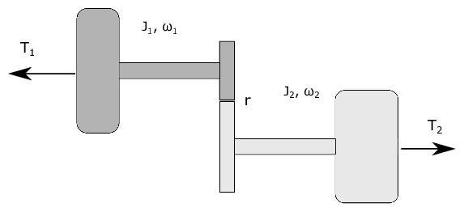

==========================
Assignment 7 - Bond Graphs
==========================

.. note::

    Submit your assignment as a single PDF, including plots and source code (if any).
    We expect academic honesty. Collaboration is encouraged, but must be declared. Any use of AI must be declared along with any other sources used.
    This is not an exam. Do your best and show that you put in effort and the assignment will be approved.

In this assignment we will study how we can use power bonds to connect submodel into a system model.

Problem 1 - Steering mechanism
------------------------------

    Simple model of a steering mechanism.

    
    Word bond graph for the steering mechanism.

Figure :numref:`steering` shows a simple model of a steering mechanism for a vehicle,
while figure :numref:`bond_graph_steering` shows a *word bond graph* for the same
steering mechanism.

.. admonition:: Tasks

    a) Draw a block diagram of the system based on the word bond graph and the causality assignment given to it.
    
    .. hint::
        :class: dropdown
        
        Recall that the causal stroke is on the submodel where the effort is 
        input and the flow is output.

    b) The following information is given about each submodel:

    - **Batter**:
        Gives a constant voltage.
    - **DC motor**:
        A DC-motor can be described by the following equations
        
        .. math::
            L_a \frac{di_a}{dt} = -R_a i_a - K_t \omega_m + u_a
            \\
            J \dot{\omega}_m = K_T i_a - \tau
        
        where :math:`L_a` is the armature inductance, 
        :math:`i_a` is the armature current, 
        :math:`R_a` is the resistance in the armature circuit, 
        :math:`K_T` is a constant, 
        :math:`\omega_m` is the speed of the motor, 
        :math:`u_a` is the armature voltage,
        and the torque :math:`\tau` is the load.
    - **Flexible shaft**: 
        A flexible shaft may have a slight difference in the angular velocity :math:`\omega_1`
        and :math: `\omega_2` of each side, resulting also in a slight difference
        :math:`\Delta \theta = \int_{t_0}^t (\omega_2 - \omega_1) dt` in the angular
        displacement on each side.
        We can think of the flexible shaft as an angular spring with a
        linear relation between the angular displacement and the torque, such that :math:`\tau = k_s \Delta \theta`.
        The moment of inertia for the shaft is small compared to the moment of inertia of the DC-motor
        and the rack, so we may consider it as massless.
    - **Gear (or pinion)**:
        The gear is modelled as massless and loss-less
        (i.e. it does not remove energy from the system).
        Its function in this system is to transform between the angular velocity
        and torque on one port, and linear velocity and a force on the other port.
        The relationship between the linear velocity and the angular velocity is :math:`v = r\omega`. 
        Since it is loss-less, we also have that the power on each port is identical.
        In equation form this can be stated as :math:`\omega \tau = v F`.
    - **Rack**:
        The rack can be modelled as mass m that can move with one degree of freedom.
        This mass is governed by the equation: :math:`ma = \sum F` .
    - **Spring**: 
        The spring gives a linear relation between the force and the displacement, such that
        the spring force :math:`F_s`  is given as :math:`F_s = kx` , where :math:`x = \int_{t_0}^t v dt`.
    - **Damper**:
        The damper (or dashpot) is governed by the law: :math:`F_d = k_d v`.

    Use the block diagram you made together with the information given above and the word bond
    graph to show that the system equations for the steering mechanism can be written as
    
    .. math::
        L_a \frac{di_a}{dt} &= -R_a i_a - K_t \omega_1 + u_a
        \\
        J \dot{\omega}_m &= K_T i_a - k_s \Delta \theta
        \\
        \dot{\Delta \theta} &= \frac{1}{r} v - \omega_1
        \\
        \dot{x} &= v
        \\
        m \dot{v} &= - kx - dv + \frac1{r} k_s \Delta \theta
    
    .. hint::
        :class: dropdown
        
        Recall that the direction of the half arrows in the word bond graph
        defines which direction of positive power (energy flow).
        This means that the half arrows will be useful in defining the sign of
        efforts and flows in the final set of differential equations.

Problem 2 - Two rotating shafts
-------------------------------

    Two rotating shafts connected by a gearbox

    Word bond graph of the system

Figure :numref:`two_rotating_masses` shows two rotating flywheels connected by a gearbox. 
The gearbox is friction-less. 
There are two torques :math:`T_1` and :math:`T_2` applied to the two flywheels. 
The left flywheel rotates with the angular speed :math:`\omega_1` and has moment of inertia :math:`J_1`,
while the right-hand flywheel rotates with an angular speed :math:`\omega_2` and has moment of inertia :math:`J_2`. 
A system model is shown in the form of a word bond graph in figure :numref:`bond_graph_two_rotating_masses`.

.. admonition:: Tasks

    a)
        Draw a block diagram for the system based on the word bond graph and the causality defined by
        the causal strokes.

    b)
        While it is tempting to use two differential equations on the form

        .. math::
            J_i \dot{\omega}_i = \sum T

        this is not viable because the two flywheels are not able to rotate independently of each other.
        If we know :math:`\omega_1`, we also know :math:`\omega_2`
        (and if we know :math:`\dot{\omega_1}` we know :math:`\dot{\omega_2}`).
        In particular, :math:`r \omega_1 = \omega_2` and :math:`\tau_1 = r \tau_2`.
        Therefore we only need a single differential equation to describe both of them.
        Show that the equation of motion for the two flywheels can be written as

        .. math::
            \left( J_1 + r^2 J_2 \right) \dot{\omega}_1 = T_1 + r T_2

    c)
        Derive the same expression using Lagrange mechanics with your generalized coordinate
        :math:`q = \theta_1` and :math:`\dot{q} = \omega_1`.
