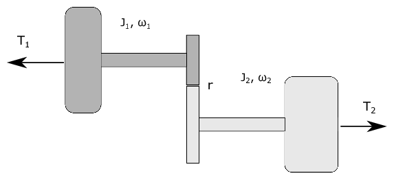

==========================
Assignment 8 - Bond Graphs
==========================

.. note::

    Submit your assignment as a single PDF, including plots and source code (if any).
    We expect academic honesty. Collaboration is encouraged, but must be declared. Any use of AI must be declared along with any other sources used.
    This is not an exam. Do your best and show that you put in effort and the assignment will be approved.

In this assignment we will study how we can use power bonds to connect submodel into a system model.

Problem 1 - Steering mechanism
------------------------------

    Simple model of a steering mechanism.

.. figure:: ./figures/assignment_7/word_bg_steering_mech.png
    :width: 100%
    :align: center
    :name: bond_graph_steering
    
    Word bond graph for the steering mechanism.

Figure :numref:`steering` shows a simple model of a steering mechanism for a vehicle,
while figure :numref:`bond_graph_steering` shows a *word bond graph* for the same
steering mechanism.

.. admonition:: Tasks

    a) Draw a block diagram of the system based on the word bond graph and the causality assignment given to it.
    
    .. hint::
        :class: dropdown
        
        Recall that the causal stroke is on the submodel where the effort is 
        input and the flow is output.

    b) The following information is given about each submodel:

    - **Battery**:
        Gives a constant voltage.
    - **DC motor**:
        A DC-motor can be described by the following equations
        
        .. math::
            L_a \frac{di_a}{dt} = -R_a i_a - K_t \omega_m + u_a
            \\
            J \dot{\omega}_m = K_T i_a - \tau
        
        where :math:`L_a` is the armature inductance, 
        :math:`i_a` is the armature current, 
        :math:`R_a` is the resistance in the armature circuit, 
        :math:`K_T` is a constant, 
        :math:`\omega_m` is the speed of the motor, 
        :math:`u_a` is the armature voltage,
        and the torque :math:`\tau` is the load.
    - **Flexible shaft**: 
        A flexible shaft may have a slight difference in the angular velocity :math:`\omega_1`
        and :math: `\omega_2` of each side, resulting also in a slight difference
        :math:`\Delta \theta = \int_{t_0}^t (\omega_2 - \omega_1) dt` in the angular
        displacement on each side.
        We can think of the flexible shaft as an angular spring with a
        linear relation between the angular displacement and the torque, such that :math:`\tau = k_s \Delta \theta`.
        The moment of inertia for the shaft is small compared to the moment of inertia of the DC-motor
        and the rack, so we may consider it as massless.
    - **Gear (or pinion)**:
        The gear is modelled as massless and loss-less
        (i.e. it does not remove energy from the system).
        Its function in this system is to transform between the angular velocity
        and torque on one port, and linear velocity and a force on the other port.
        The relationship between the linear velocity and the angular velocity is :math:`v = r\omega`. 
        Since it is loss-less, we also have that the power on each port is identical.
        In equation form this can be stated as :math:`\omega \tau = v F`.
    - **Rack**:
        The rack can be modelled as mass m that can move with one degree of freedom.
        This mass is governed by the equation: :math:`ma = \sum F` .
    - **Spring**: 
        The spring gives a linear relation between the force and the displacement, such that
        the spring force :math:`F_s`  is given as :math:`F_s = kx` , where :math:`x = \int_{t_0}^t v dt`.
    - **Damper**:
        The damper (or dashpot) is governed by the law: :math:`F_d = k_d v`.

    Use the block diagram you made together with the information given above and the word bond
    graph to show that the system equations for the steering mechanism can be written as
    
    .. math::
        L_a \frac{di_a}{dt} &= -R_a i_a - K_t \omega_1 + u_a
        \\
        J \dot{\omega}_m &= K_T i_a - k_s \Delta \theta
        \\
        \dot{\Delta \theta} &= \frac{1}{r} v - \omega_1
        \\
        \dot{x} &= v
        \\
        m \dot{v} &= - kx - dv + \frac1{r} k_s \Delta \theta
    
    .. hint::
        :class: dropdown
        
        Recall that the direction of the half arrows in the word bond graph
        defines which direction of positive power (energy flow).
        This means that the half arrows will be useful in defining the sign of
        efforts and flows in the final set of differential equations.

Problem 2 - Two rotating shafts
-------------------------------

    Two rotating shafts connected by a gearbox

    Word bond graph of the system

Figure :numref:`two_rotating_masses` shows two rotating flywheels connected by a gearbox. 
The gearbox is friction-less. 
There are two torques :math:`T_1` and :math:`T_2` applied to the two flywheels. 
The left flywheel rotates with the angular speed :math:`\omega_1` and has moment of inertia :math:`J_1`,
while the right-hand flywheel rotates with an angular speed :math:`\omega_2` and has moment of inertia :math:`J_2`. 
A system model is shown in the form of a word bond graph in figure :numref:`bond_graph_two_rotating_masses`.

.. admonition:: Tasks

    a)
        Draw a block diagram for the system based on the word bond graph and the causality defined by
        the causal strokes.

    b)
        While it is tempting to use two differential equations on the form

        .. math::
            J_i \dot{\omega}_i = \sum T

        this is not viable because the two flywheels are not able to rotate independently of each other.
        If we know :math:`\omega_1`, we also know :math:`\omega_2`
        (and if we know :math:`\dot{\omega_1}` we know :math:`\dot{\omega_2}`).
        In particular, :math:`r \omega_1 = \omega_2` and :math:`\tau_1 = r \tau_2`.
        Therefore we only need a single differential equation to describe both of them.
        Show that the equation of motion for the two flywheels can be written as

        .. math::
            \left( J_1 + r^2 J_2 \right) \dot{\omega}_1 = T_1 + r T_2

    c)
        Derive the same expression using Lagrange mechanics with your generalized coordinate
        :math:`q = \theta_1` and :math:`\dot{q} = \omega_1`.

In this assignment we will develop bond graphs for three different systems. A mechanical system, an electrical system and a hydraulic system.

Problem 1 - Pendulum on an oscillator
-------------------------------------

.. figure:: ./figures/assignment_8/pendulum_osc.png
    :width: 100%
    :align: center
    :name: assignment_8_pendulum

    Pendulum on a vertical oscillator.

We will revisit the oscillating pendulum one last time. 
This time we will use bond graph to model the system.

Figure  :numref:`assignment_8_pendulum` shows a sketch of the system. 
A pendulum with a point mass :math:`m_2` is attached to a mass :math:`m_1` that can oscillate along a vertical axis. 
The pendulum rod has a length :math:`L` and the rod can be considered mass-less 
(i.e. the pendulum can be considered as a point mass at the end of a mass-less rod).

The oscillating mass is connected to a stationary construction through a spring with stiffness :math:`k`. 
The vertical position :math:`z` of the mass is defined such that :math:`z = 0` when the spring is in its neutral position.
The angular displacement of the pendulum rod is :math:`\theta`, as shown in the figure. 
For simplicity we also constrain body one to only move up or down, i.e no movement along the :math:`y_0` or :math:`z_0` axis.

.. admonition:: Tasks
    
    a. Draw a bond graph for the system, as described above. Include gravity force on the two masses.

    .. hint::
        :class: dropdown
        
        A good starting point is to place a 1-junction for each relevant velocity.
        In this case, you will need a velocity representing the vertical movement of the oscillating mass, and two 1-junctions representing the horizontal velocity and the vertical velocity of the pendulum mass.
        In addition, you will need a 1 junction for :math:`\dot{\theta}` because the vertical and horizontal velocity of the point mass on the pendulum is a function of :math:`\dot{\theta}`.
        You then need to establish a relationship between them using MTF-elements and 0-junctions.
    
    b. Now include linear friction on the motion of oscillating mass and the pendulum hinge.

    c. Assume now that the mass at the end of the pendulum is not a point mass but a sphere with mass :math:`m_2` and moment of inertia of :math:`J_2`. Update the bond graph to account for this.

Problem 2 - Electrical circuit with a battery
---------------------------------------------

    Electrical circuit with a battery.

Figure  :numref:`assignment_8_electrical` show an electrical circuit powered by voltage source :math:`u(t)`. 
The task is to develop a bond graph for this system. 
The parameters for the two resistors, two capacitors and the inductance, are :math:`R_1` and :math:`R_2`, :math:`C_1` and :math:`C_2`, and :math:`L` respectively.

.. admonition:: Task
    
    Make a bond graph for the circuit.

Problem 3 - Single acting spring return hydraulic actuator
----------------------------------------------------------

    A single acting spring return hydraulic actuator powered by a hydraulic pump.

Figure  :numref:`assignment_8_hydraulic` shows a hydraulic system were fluid can be pumped from a reservoir and into to single acting hydraulic actuator, or back to the reservoir via a controllable valve.
The opening area of the valve can be controlled though the signal :math:`u(t)` to return fluid to the reservoir and hence reduce the pressure on the hydraulic actuator.
When the pressure is low enough, the spring will return the hydraulic actuator piston back to the position :math:`x = 0`.

.. admonition:: Task
    
    Draw a bond graph for this system where :math:`P_a`  is the atmospheric pressure.