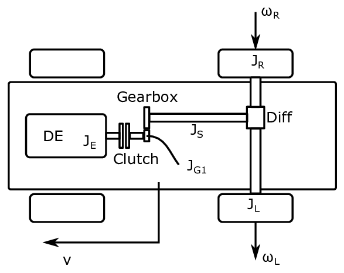
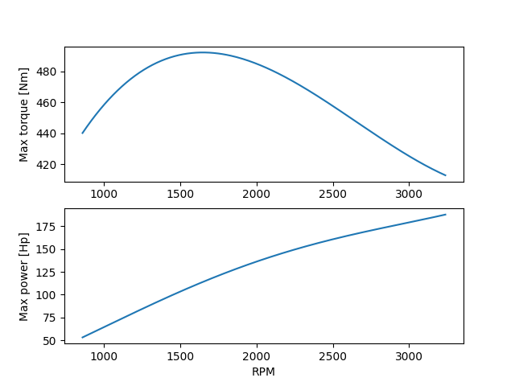

==============================
Assignment 9 - Bond Graphs III
==============================

.. note::

    Submit your assignment as a single PDF, including plots and source code (if any).
    We expect academic honesty. Collaboration is encouraged, but must be declared. Any use of AI must be declared along with any other sources used.
    
    This is not an exam. Do your best and show that you put in effort and the assignment will be approved.

In this assignment we will build bond graph models, assign causality and extract state space equations from the models.
Specifically, will make a simple system model of the drive-line of a rear wheel drive diesel powered car as outlined in :numref:`assignment_9_drive_line`.
The drive line includes a diesel engine, a clutch, a gearbox (with only one gear), a drive shaft, a differential and rear wheels with shafts.

    
    Schematic drawing of the drive-line of a car.

Problem 1 - Car drive line
--------------------------

In the first problem, we will consider the diesel engine, the gearbox and the drive shaft (the shaft between the gear box and rear axle).

.. admonition:: Tasks
    
    a. 
    
        We begin by modelling the diesel engine as a rotating mass. 
        The engine torque :math:`T_E` is given by a throttle signal :math:`u_T` (e.g. a signal given from the driver). 
        We assume that the actual engine torque will be able to follow the throttle signal perfectly except when it exceeds the torque limit :math:`T_{\max} (\omega_E)`. 
        In order to ensure that that the engine does not exceed the torque limit and does not deliver negative torque, we saturate the throttle signal according to

        .. math::
        
            T_E = \max(0, \min(u_T , T_{\max} (\omega_E)))
        
        Note, however, that we do not need to worry about the details of this saturation function for now.
        The engine, including the shaft connected to the clutch, has a moment of inertia of :math:`J_E` and the total friction torque can be modelled as linearly dependent on the engine speed with the constant :math:`R_E`.

        Draw a bond graph for the system and assign causality.
        Verify that the causality is consistent with the power port of the abstract diesel engine submodel shown in :numref:`assignment_9_diesel_engine`.

        .. figure:: ./figures/assignment_9/diesel_engine_submodel.png
            :width: 10cm
            :align: center
            :name: assignment_9_diesel_engine

            Diesel engine submodel.

    b. 
    
        We continue by modelling the gear along with the connecting shafts (gearbox and drive shaft model). 
        On the engine side, we have a cogwheel with :math:`N_1` teeth and a shaft that rotates with the angular velocity :math:`\omega_{G1}` and with an moment of inertia :math:`J_{G1}`. 
        The bearings for this shaft has some friction. 
        The friction force can be modelled as linearly dependent on the angular speed through through the constant :math:`R_{G1}`.
        On the drive shaft side we have a cog wheel with :math:`N_2` teeth that rotates together with the drive shaft at the speed :math:`\omega_S` and with an moment of inertia :math:`J_S`. 
        The linear friction coefficient on this side is :math:`R_{G2}`.
        
        Draw a bond graph for this system without using any compliance between the two rotating masses.

    c. 
    
        Now connect the diesel engine model and the gearbox drive shaft model through a simple clutch model. 
        The clutch can be modelled as a friction torque proportional to the difference between the angular velocity of the engine and the angular velocity of the cogwheel on the engine side. 
        A signal input :math:`u_C` to the clutch decides how big the linear friction coefficient is (i.e. the input signal scales it from :math:`R_C = 0` for :math:`u_C = 0` to :math:`R_C = R_{C, \max}` for :math:`u_C = 1`).
        The abstract 2-port submodel for the clutch is illustrated in :numref:`assignment_9_clutch`. 
        Use this and your solution from the first two tasks to draw a bond graph for the diesel engine, clutch, gearbox and drive shaft.
        Also assign causality.

        .. figure:: ./figures/assignment_9/clutch_submodel.png
            :width: 8cm
            :align: center
            :name: assignment_9_clutch

            Clutch submodel.
        
    d. 
    
        Extract state equations for the bond graph from the previous task.

Problem 2 - Rear axle and car assembly
--------------------------------------

We will now model the rear axle, and see how the power associated to the angular speed of the drive shaft can be utilized to move the car.
If you are not sure how a differential works, there are videos on YouTube explaining it (e.g. `Around The Corner - How Differential Steering Works (1937) <https://www.youtube.com/watch?v=yYAw79386WI>`_).

.. admonition:: Tasks

    a. 
    
        We start by considering the wheels of the car to be suspended over ground such that they can rotate freely (without causing the car to move).
        This will allow us to first focus on the rear axle without considering the motion of the car, before we study the car motion in the next task.
        The wheel on the right side of the car, along with the right side of the rear axle, rotates with the angular speed :math:`\omega_R`, and has a moment of inertia :math:`J_R`, and rotates with a linear friction coefficient :math:`R_R`.
        The wheel on the left side rotates with the angular speed :math:`\omega_L`, and has a moment of inertia :math:`J_L` and friction coefficient :math:`R_L`.
        The purpose of the differential is to transfer a torque from the drive shaft to both the left and right part of the rear axle while at the same time allowing them to rotate at different speeds.
        As such, the differential can be modelled as a simple junction element.
        In addition it is necessary to model the inertia and friction of the existing system.
        It is easiest to model the rear axle if we use a torque input on the drive shaft port as seen in :numref:`assignment_9_drive_line`.
        Note that this is not compatible with the final bond graph of the previous task.
        We will attend to this shortly.

        .. figure:: ./figures/assignment_9/rear_axle.png
            :width: 8cm
            :align: center
            :name: assignment_9_rear_axle_naive

            Rear axle submodel

        Draw a bond graph for the rear axle.
        Including friction associated to the angular speed of the left and right part of the rear axle.
        Include also the moment of inertia for the left and right side (including the wheels).
        Assign causality.

    b. 

        The causality of the rear axle is not compatible with the causality of the drive shaft.
        The rear axle model expects the drive shaft to set a torque, while the drive shaft provides an angular velocity, and also expects a torque input.
        One way of fixing this problem, is to consider a small flexible element between the rear axle and the drive shaft, as indicated in :numref:`assignment_9_rear_axle_improved`.
        This will take the angular speed of the rear axle and the drive shaft as input and calculate a torque proportional to :math:`\Delta \theta = \int \left(\omega_S - \omega_{RA}\right) dt`.
        In this case, the flexible element needs to be very stiff.
        
        Draw a new bond graph for the rear axle where the flexible shaft element is included.
        Assign causality, and verify that the rear axle will now be compatible with the last model in the Problem 1.

        .. figure:: ./figures/assignment_9/flexible_element.png
            :width: 14cm
            :align: center
            :name: assignment_9_rear_axle_improved

            Improved rear axle submodel

    c. 

        Now we will connect the rear wheels to the road with slip.
        This basically means that we will not assume infinite friction between the wheel and the road surface.
        Instead we will model the contact in a similar manner as for the clutch for each of the wheels.
        More specifically, the force acting from one of the wheels on the car is given as
        
        .. math::
        
            F_{w,i} = R_{w,i} \left( r \omega_i - v \right)
        
        where :math:`i` is :math:`L` or :math:`R`, and :math:`r` is the radius of the wheels.

        .. figure:: ./figures/assignment_9/contact.png
            :width: 10cm
            :align: center
            :name: assignment_9_road_wheel_contact

            Model for the contact between the road and the wheel.

        Draw a bond graph for the submodel.

    d.

        Make a simple submodel for the 1D motion of the car.
        We do not care about the front wheels of the car. 
        Include the inertia related to the mass :math:`m` of the car as well as linear friction (we use linear friction for simplicity even thought a quadratic relation would be more appropriate if the element represents drag).

    e. 

        Assemble the whole drive line and car model.
        Start by connecting the rear axle with a ”wheel and road contact”-model for each of the two wheels on the rear axle.
        Also connect the two ”wheel and road contact”-models to a 1D car with mass :math:`m` and linear friction with coefficient :math:`R_{car}`. 
        
        .. hint:: 
            
            Think of the car as a 1D wagon with two force inputs (one from each wheel) and a damper to represent drag.
        
        Proceed by connecting the drive shaft to the differential through the flexible element in task 2b.

    f.

        Assign causality and extract state equations for the bond graph from the previous task.

Problem 3 - Simulation (Optional)
---------------------------------

In this task we simulate the car model. 
Please find the Jupyter notebook in the `code handout repository <https://github.com/TTK4130/code-handouts>`_.

In the template we have implemented an engine controller that is meant to simulate a human that controls the throttle with the objective of maintaining constant RPM on the engine while engaging the clutch.

We have also implemented a ramp function that will spend a certain amount of time on going from fully disengaged clutch to maximally engaged clutch (approximately like one would do when driving a car with manual transmission).

We have also implemented the following torque limitation for the motor, as a function of the RPM, which approximates General Motor's 6.5TD (6.5 liter turbo diesel engine) from the 1990s.

.. math::

    T_{\lim} (\omega_E) = 213.5 + 3.8 \omega_E - 0.016 \omega_E^2 + 1.92 \cdot 10^{-5} \omega_E^3

The resulting torque and power limit is shown in :numref:`assignment_9_GM_65_TD_plot`.

    
    Approximation of torque and power limitation for GM's 6.5TD engine

Your task is to fill in your state equations in the notebook as indicated. After doing this, you may run the simulator script to make a simulation and plot your states.

A few comments/hints:

* We have assumed that the state in the first position of the state vector is the engine angular momentum. If this is not case for you, you will have to change the code where the initial condition for the engine is set.
* If you are playing around with the parameters, try to make sure that the engine speed does not drop too low as its ability to produce torque decreases rapidly as the RPM sinks below what is shown in the curve above.
* The plotting script at the end of the simulator script assumes the following state vector (which you may adapt according to your needs):

  * engine angular momentum
  * angular momentum at engine side gear
  * twist angel (deflection) of driveshaft/differential connection
  * angular momentum of right wheel (and right side of rear axle)
  * angular momentum of left wheel (and left side of rear axle)
  * linear momentum of the car

A suggestion for suitable parameters are provided in the templates but you are of course also free to experiment with different parameters.