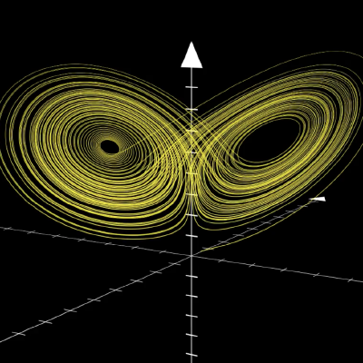

============================================
Welcome to Modelling and Simulation!
============================================

.. toctree::
    :maxdepth: 1
    :caption: Contents:

    installation
    jupyter-notebook
    sympy-and-cas
    numerical-methods-for-odes
    reference-frames
    quaternions
    assignments/index
    lecture-notes/index
    sympy-live
    notation
    bibliography

About this website
===================

This website is an online resource for students taking the course `Modelling and Simulation TTK4130 <https://www.ntnu.edu/studies/courses/TTK4130#tab=omEmnet>`_ at
the Norwegian University of Science and Technology. Although it's a supplement to the course curriculum,
it's also written as to be available to anyone eager to learn about the topics taught in this course. The goal
of this website is to take a more hands-on approach to modelling and simulation of dynamical systems. All
code is written in Python using a mix of openly available tools and libraries. You are highly encouraged
to code along when possible and play around with the provided code. Any issues or questions regarding
this website are directed to the `Github repository <https://github.com/ttk4130/ttk4130.github.io>`_ where the code is hosted.

Prerequisites
===============
- Basic programming knowledge
- Familiarity with Python
- Basic Linear Algebra
- Familiarity with Control Systems

What will you learn (being updated)?
====================================

After completing this website you should be able to use Python to solve systems of equations both algebraically and numerically.
You should also know how fundamental numerical methods are implemented as well as their limitations.

Why Python?
==================

It's no secret that Matlab has been dominating in academia for some years, so why teach how to use Python?
The first obvious answer is price. Matlab is a commercial product not available to everyone, including companies.
The second answer is availability. Python is one of the most popular programming languages in the world. This is no
accident. Due to a vibrant community of open-source projects and contributors Python continues to flourish. An example of this
is Sphinx, which this website is built with. Another reason is one of pedagogy. Matlab often does more than you ask it to.
By doing all the "dirty work" in Python we get a much better understanding of how these tools work and their limitations.
In the end it all comes down to preference. We like Python, and we hope you'll like it too!

.. jupyter-execute::

    print("Hello world!")

Did you know Python can do symbolic math?

.. jupyter-execute::

   import sympy as sm
   sm.init_printing(use_latex='mathjax')
   
   b, t, phi = sm.symbols('b, t, phi')
   b, t, phi
