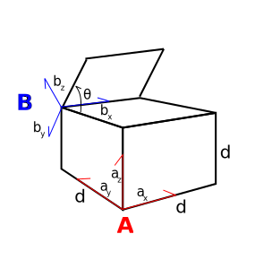
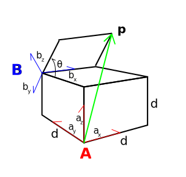
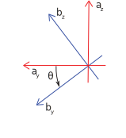

============================
Reference frames
============================

.. note::

    This page is based on the `SymPy mechanics module documentation <https://docs.sympy.org/latest/modules/physics/mechanics/index.html>`_.

Reference frames are useful when examining the relationships between bodies in multibody systems. It also serves a useful purpose in physics when working with inertial frames, where Newton's laws of physics apply, and non-inertial reference frames.
We can loosely define a reference frames as the `Euclidean space <https://en.wikipedia.org/wiki/Euclidean_space>`_ spanned by orthogonal unit vectors oriented following the `right-hand rule <https://en.wikipedia.org/wiki/Right-hand_rule>`_. This may be a two dimensional space spanned by two unit orthogonal unit vectors or a three dimensional space spanned by three orthogonal unit vectors.
In this course reference frames don't have a position in space, but are defined by orientation alone. We often define reference frames relative to some "base frame" that we consider fixed in space. This may be the center of mass on a drone or the center of the earth in a navigation system. We can think of reference frames intuitively as perspectives. The characters on this page change relative to me as I change my perspective (or reference frame) in 3D space. If I rotate my phone while taking a picture, the world rotates relative to the reference frame of the camera.

Unit Vectors
=============

Vectors have both a magnitude and a direction. Unit vectors are vectors with a magnitude of *one* oriented parallel to a direction (or dimension) in the reference frame they span.
We can think of a reference frame as a box in 3D. A unit vector points along the side of the box. For convenience, we often like to imagine the unit vectors being aligned in a corner of a "box" pointing along the edges of the box.
A unit vector follows the right-hand rule. This means that a reference system :math:`A` defined by the orthogonal unit vectors :math:`\hat{a}_x`, :math:`\hat{a}_y`, :math:`\hat{a}_z`, the following cross-products hold

.. math::

    \hat{a}_x \times \hat{a}_y = \hat{a}_z

    \hat{a}_z \times \hat{a}_x = \hat{a}_y

    \hat{a}_y \times \hat{a}_z = \hat{a}_x

Note that the unit vectors :math:`\hat{a}_x`, :math:`\hat{a}_y`, :math:`\hat{a}_z` are by definition fixed in reference frame :math:`A`. If we want to define a new reference frame :math:`B` relative to frame :math:`A` we can express their relative orientation with the relationship between their respective unit vectors.
We'll examine this in the next section.

.. note::

    **Basis vectors** are vectors that define a reference frame, but they are not necessarily of unit length. When the basis vectors are normalized to have a magnitude of one, they become unit vectors. In an orthonormal reference frame, the basis vectors are both unit vectors and mutually perpendicular.

Simple Rotation Example
=======================

.. _fig:box:

    Box with sides :math:`d` with rotating lid

The figure :numref:`fig:box` depicts a box with sides :math:`d` and a rotating square lid with sides :math:`d`. The lid is rotated
by an angle :math:`\theta` relative to the box. If we want to find some vector :math:`\vec{p}` represented in terms of reference frame :math:`A`, we simply find and substitute its elements in frame :math:`B`.

.. _fig:box_w_vector:

    Box with sides :math:`d` with rotating lid and vector :math:`\vec{p}`

Using the unit vectors, we see that :math:`\vec{p} = d \hat{a}_y + d \hat{a}_z + d \hat{b}_x - d \hat{b}_y`. By looking at the hinge, we can find the relationship between the unit vectors of frame :math:`A` and frame :math:`B`.

.. _fig:box2d:

    2D representation of :numref:`fig:box` rotating lid

Looking at the hinge in :numref:`fig:box2d`, we use trigonometry to find

.. math::
    :label: x-rotation-example

    \hat{b}_x = \hat{a}_x

    \hat{b}_y = \cos(\theta) \hat{a}_y - \sin(\theta) \hat{a}_z

    \hat{b}_z = \sin(\theta) \hat{a}_y + \cos(\theta) \hat{a}_z

We can then substitute the unit vectors in frame :math:`B`

.. math::

    \vec{p} = d \hat{a}_y + d \hat{a}_z + d \hat{b}_x - d \hat{b}_y

    \vec{p} = d \hat{a}_y + d \hat{a}_z + d \hat{a}_x - d (\cos(\theta) \hat{a}_y - \sin(\theta) \hat{a}_z)

    p^A =
    \begin{bmatrix}
    d \\
    d - d \cos(\theta) \\
    d + d \sin(\theta)
    \end{bmatrix}

Intuitively, we know this to be the case, since we know that when the lid is closed (:math:`\theta = 0`) :math:`\vec{p} = d \hat{a}_x + d \hat{a}_z`, and
when the lid is open (:math:`\theta = \frac{\pi}{2}`) :math:`\vec{p} = d \hat{a}_x + d \hat{a}_y + 2d \hat{a}_z`.

We can generalize this by a matrix product in :eq:`x-rotation-example`

.. math::

    \begin{bmatrix}
    \hat{b}_x \\
    \hat{b}_y \\
    \hat{b}_z
    \end{bmatrix}
    =
    \begin{bmatrix}
    1 & 0 & 0 \\
    0 & \cos(\theta) & -\sin(\theta) \\
    0 & \sin(\theta) & \cos(\theta)
    \end{bmatrix}
    \begin{bmatrix}
    \hat{a}_x \\
    \hat{a}_y \\
    \hat{a}_z
    \end{bmatrix}
    =
    {\bf R}_A^B(\theta)
    \begin{bmatrix}
    \hat{a}_x \\
    \hat{a}_y \\
    \hat{a}_z
    \end{bmatrix}

This matrix is the transformation matrix **from** :math:`A` **to** :math:`B`, :math:`{\bf R}_A^B(\theta)`, which means we can transform any vector in frame :math:`A` to its representation in frame :math:`B` by means of matrix multiplication.
This kind of transformation matrix belongs to a group we call rotation matrices. More specifically, it belongs to the `special orthogonal group 3 (SO(3)) <https://en.wikipedia.org/wiki/3D_rotation_group>`_. This means that
it has useful properties such that its inverse is equal to its transpose, meaning :math:`{{\bf R}_A^B}^T(\theta) = {{\bf R}_A^B}^{-1}(\theta) = {\bf R}_B^A(\theta)`, thus

.. math::

    {\bf v}^B = {\bf R}_A^B(\theta) {\bf v}^A

    {\bf v}^A = {{\bf R}_B^A}^T(\theta) {\bf v}^B = {{\bf R}_B^A} (\theta){\bf v}^B

Instead of looking at unit vectors to find :math:`p^A`, we can simply transform the components of :math:`\vec{p}` in the :math:`B`-frame **from** :math:`B` **to** :math:`A`.

.. note::

    We use the following convention for transformation matrices :math:`{\bf R}_{from}^{to}`

.. math::

    p^A
    =
    \begin{bmatrix}
    0 \\
    d  \\
    d
    \end{bmatrix}
    +
    {\bf R}_B^A
        \begin{bmatrix}
    d \\
    -d  \\
    0
    \end{bmatrix}

calculating that

.. math::

    {\bf R}_B^A
    =
    {{\bf R}_A^B}^T
    =
    {
    \begin{bmatrix}
    1 & 0 & 0 \\
    0 & \cos(\theta) & -\sin(\theta) \\
    0 & \sin(\theta) & \cos(\theta)
    \end{bmatrix}
    }^T
    =
    \begin{bmatrix}
    1 & 0 & 0 \\
    0 & \cos(\theta) & \sin(\theta) \\
    0 & -\sin(\theta) & \cos(\theta)
    \end{bmatrix}

We insert and get

.. math::

    p^A
    =
    \begin{bmatrix}
    0 \\
    d  \\
    d
    \end{bmatrix}
    +
    \begin{bmatrix}
    1 & 0 & 0 \\
    0 & \cos(\theta) & \sin(\theta) \\
    0 & -\sin(\theta) & \cos(\theta)
    \end{bmatrix}
    \begin{bmatrix}
    d \\
    -d\\
    0
    \end{bmatrix}
    =
    \begin{bmatrix}
    d \\
    d - d \cos(\theta) \\
    d + d \sin(\theta)
    \end{bmatrix} \  \ \blacksquare.

We can easily implement this in SymPy

.. jupyter-execute::

    import sympy as sm
    sm.init_printing(use_latex='mathjax')
    from sympy import sin, cos

    theta, d = sm.symbols('theta d')
    R_b_to_a = sm.Matrix([  [1, 0, 0],
                            [0, cos(theta), sin(theta)],
                            [0, -sin(theta), cos(theta)]])
    R_b_to_a

.. jupyter-execute::

    v_A = sm.Matrix([0, d, d]) + R_b_to_a @ sm.Matrix([d, -d, 0])
    v_A

SymPy Reference Frames
======================

As you can see from section :ref:`Simple Rotation Example`, even simple examples can get quite tedious when working with reference frames. Luckily, the SymPy module :external:py:obj:`~sympy.physics.vector` implements reference frames with the :external:py:class:`~sympy.physics.vector.frame.ReferenceFrame` class.

.. jupyter-execute::

    from sympy.physics.vector import ReferenceFrame

    A = ReferenceFrame('A')

Each reference frame has three associated basis vectors that define the frame

.. jupyter-execute::

    A.x, A.y, A.z

We can create new vectors by using the basis vectors

.. jupyter-execute::

    a = d*A.y + d*A.z
    a

We can orient a new reference :math:`B` relative to our frame :math:`A` with an axis rotation around :math:`\hat{a}_x`

.. jupyter-execute::

    B = A.orientnew('B', 'Axis', [-theta, A.x]) # negative x-axis rotation from box example

If we want the rotation matrix between two frames, we can call the *direction cosine matrix* or `dcm` method

.. jupyter-execute::

    B_to_A = B.dcm(A)
    B_to_A

SymPy makes it trivial to solve the simple example in :numref:`fig:box_w_vector`

.. jupyter-execute::

    b = d*B.x - d*B.y
    p = a + b
    p

Using the `express` method we can find the vector :math:`v^A`. As long as there is a relationship between the reference frames
in a vector, SymPy will be able to automatically calculate the vector relative to any frame.

.. jupyter-execute::

    p.to_matrix(A) # Print as matrix relative to frame A

Implementation Details
-------------------------------

The `ReferenceFrame` class stores the name given upon creation as a string and its orientation as a direction cosine matrix (dcm) with type `sympy.Matrix`. Crucially, it also stores the relationships between other reference frames in a private dictionary, `_Frame__frame_dict`.
The dictionary uses `ReferenceFrames` as keys and direction cosine matrices with type `sympy.Matrix` as values. These are set bi-directionally, which means that if we orient reference frame :math:`A` to :math:`B` we set the key :math:`B` and `Matrix` for frame :math:`A`'s dictionary,
and the key :math:`A` and the transposed `Matrix` for frame :math:`B`'s dictionary.

.. admonition:: Exercise

    Use SymPy ReferenceFrames to find an expression of the position relative to origin (base of the robot) of the end effector on the SCARA robot depicted below. Use
    :math:`\theta` to denote the joint angles, :math:`d` to denote link length and :math:`J3` to denote the z-displacement.

    .. figure:: https://upload.wikimedia.org/wikipedia/commons/0/09/SCARA_robot_2R.png
        :width: 50%

        Mitsubishi Electric Automation, Inc. 500 Corporate Woods Pkwy - Vernon Hills, IL - 60061 - US, CC BY-SA 4.0 <https://creativecommons.org/licenses/by-sa/4.0>, via Wikimedia Commons

.. dropdown:: Solution
    :color: success

    .. jupyter-execute::

        from sympy import symbols
        from sympy.physics.vector import ReferenceFrame

        theta1, theta2, theta3 = symbols('theta1:4') # Angles
        J3, d1, d2 = symbols('J3 d_1 d_2') # Distances (z-displacement is defined by actuator height)

        origin = ReferenceFrame('O')
        J1 = origin.orientnew('J1', 'Axis', [theta1, origin.z])
        J2 = J1.orientnew('J2', 'Axis', [theta2, J1.z])
        J4 = J2.orientnew('J4', 'Axis', [theta3, J2.z])

        p = d1 * J1.x + d2 * J2.x + J3 * J4.z
        p.to_matrix(origin) # Print matrix form relative to origin

Euler angles
==================

.. warning::

    Rotations in 3D space can often be confusing. This confusion arises from all the different convention used, or rather the lack thereof. **There is logic to rotations**, so just hold on tight and
    pay attention to the following subsections.

In three dimensional space we can transform to any orientation we wish by applying three separate rotations. The rotations can be performed around each axis once (e.g. X -> Y -> Z) which are referred to as `Tait-Bryan angles <https://en.wikipedia.org/wiki/Euler_angles#Tait-Bryan_angles>`_, or with one axis repeated once (e.g. X -> Y -> X), which are referred to as `proper (or classical) Euler angles <https://en.wikipedia.org/wiki/Euler_angles#Classic_Euler_angles>`_ :cite:t:`sensorbook`. Tait-Bryan angles are the most intuitive way to visualize such a sequence of rotation because they can be
interpreted as *roll, pitch and yaw*. We can imagine such a sequence of rotation by first rotating your reference frame :math:`A` about the :math:`\hat{a}_z`-axis, rotating the newly rotated reference frame :math:`A'` about :math:`\hat{a'}_y`-axis and finally
rotating the new coordinate system :math:`A''` about :math:`\hat{a''}_x`. This type of rotation with mobile axes is called an *intrinsic* sequence of rotation.

Intrinsic and Extrinsic Rotations
---------------------------------

Rotations of Euler angles can be done in an *intrinsic* or *extrinsic* manner. Intrinsic rotation means that the axes are mobile, such as in the example in the example above.
During each rotation the the axes are rotated. The next rotation is then carried out around the axis rotated by the previous rotations. Extrinsic rotations means that all the rotations
are applied around the original fixed axes of the original frame.

An intrinsic sequence of rotation can be written as

.. math::

    \begin{align*}
    \{a'_x, a'_y, a'_z\} &= R_{z, \psi} \{a_x, a_y, a_z\}, \\[1mm]
    \{a''_x, a''_y, a''_z\} &= R_{y', \theta} \{a'_x, a'_y, a'_z\}, \\[1mm]
    \{a'''_x, a'''_y, a'''_z\} &= R_{x'', \phi} \{a''_x, a''_y, a''_z\}.
    \end{align*}

(Derived from :cite:t:`sensorbook`)

The example above implements:

1. First rotation: Z-axis of initial frame A by angle :math:`\psi`
2. Second rotation: Y-axis of the rotated frame A' by angle :math:`\theta`
3. Third rotation: X-axis of the new rotated frame A'' by angle :math:`\phi`

An extrinsic rotation sequence means that we transform around the same axes:

.. math::

    \{a'''_x, a'''_y, a'''_z\} = R_{z, \psi} R_{y, \theta} R_{x, \phi} \{a_x, a_y, a_z\}.

(Derived from :cite:t:`sensorbook`)

The example above implements:

1. First rotation: Fixed Z-axis of A by psi
2. Second rotation: Fixed Y-axis of A by theta
3. Third rotation: Fixed X-axis of A by phi

Intrinsic-extrinsic equivalence
-------------------------------

We have now seen the difference between extrinsic and intrinsic rotations. Intrinsic rotations are easier to visualize, but harder to compute by hand
since you have to keep track of the intermediary axes. Extrinsic rotations are much easier to compute from a mathematical perspective since you always rotate relative to the same frame.
Luckily, there we can replace intrinsic rotations with equivalent extrinsic rotations and vise versa. Intrinsic rotations yield the same result as extrinsic
rotations carried out in the opposite sequence :cite:t:`sensorbook`.

.. math::

    \begin{align*}
    \{a'''_x, a'''_y, a'''_z\} &= R_{x'', \phi} R_{y', \theta} R_{z, \psi} \{a_x, a_y, a_z\} \\[1mm]
    &= R_{z, \psi} R_{y, \theta} R_{x, \phi} \{a_x, a_y, a_z\}.
    \end{align*}

We can now relate this to the ZYX convention often used in navigation. It's common to use the intrinsic sequence of rotation yaw-pitch-roll (Z -> Y -> X), which
we now know is equivalent to the extrinsic sequence of rotation roll-pitch-yaw (X -> Y -> Z): :math:`R (\phi, \theta, \psi) = R_{a_z, \psi}R_{a_y, \theta}R_{a_x, \phi}`

.. math::
    \begin{align*}
    R_{a_x,\phi} &= \begin{bmatrix} 1 & 0 & 0 \\ 0 & c\phi & -s\phi \\ 0 & s\phi & c\phi \end{bmatrix} \\
    R_{a_y,\theta} &= \begin{bmatrix} c\theta & 0 & s\theta \\ 0 & 1 & 0 \\ -s\theta & 0 & c\theta \end{bmatrix} \\
    R_{a_z,\psi} &= \begin{bmatrix} c\psi & -s\psi & 0 \\ s\psi & c\psi & 0 \\ 0 & 0 & 1 \end{bmatrix} \\
    R(\phi, \theta, \psi)
    &= \begin{bmatrix} c\psi c\theta & -s\psi c\phi + c\psi s\theta s\phi & s\psi s\phi + c\psi s\theta c\phi \\ s\psi c\theta & c\psi c\phi + s\psi s\theta s\phi & -c\psi s\phi + s\psi s\theta c\phi \\ -s\theta & c\theta s\phi & c\theta c\phi \end{bmatrix}
    \end{align*}

.. note::

    c = cos, s = sin

**Why bring this up? I'm more confused now...**

The reason we bring this up is to stress the importance of being explicit about the conventions and definitions you use when
working with rotations. If you don't, it will inevitably lead to even more confusion.

SymPy 3D rotations
----------------------------

The sympy method :external:py:obj:`~sympy.physics.vector.frame.ReferenceFrame.orient_body_fixed` implements three successive body fixed simple axis right-hand rotations.
We can orient a new reference frame by providing the parent frame, three angles and the order of rotation. The example below orients a new frame :math:`B` relative to frame :math:`A` by an intrinsic ZYX sequence of rotations (or XYZ extrinsic sequence of rotation).

.. jupyter-execute::

    A = ReferenceFrame('A')
    B = ReferenceFrame('B')

    phi, theta, psi = symbols('phi, theta, psi')

    B.orient_body_fixed(A, (psi, theta, phi), 'ZYX') # Tait-Bryan intrinsic ZYX rotation
    A_to_B = B.dcm(A).T
    A_to_B

As we can see, this agrees with our definitions in the previous subsection. Simply putting our arguments in the wrong order would have given a different result.
The reason we go into such detail is to make it very clear that you need to know how rotations are implemented when using a library. If you're not sure how they are implemented
it's often better to implement them yourself.

SymPy's `orient_explicit()` method implements a way of orienting frames explicitly with direction cosine matrices. This way of orienting frames is prone to mistakes if you've defined your dcm incorrectly, so use it with caution.

.. jupyter-execute::

    from sympy import Matrix, cos, sin

    N = ReferenceFrame('N')
    A = ReferenceFrame('A')
    theta = symbols('theta')

    # DCM for rotating about z-axis
    dcm = Matrix([
        [cos(theta), -sin(theta), 0],
        [sin(theta), cos(theta), 0],
        [0, 0, 1]
    ])

    A.orient_explicit(N, dcm) # Orient frame A w.r.t. to frame N
    N_to_A = N.dcm(A)
    N_to_A

.. admonition:: Exercise: Skydio drone

    The drone illustrated in the picture below is oriented relative to the inertial frame :math:`N`. Use Euler angles ZXY convention to find the orientation of the camera relative to frame :math:`N` by using the intermediary frames :math:`BODY` and :math:`CAM`.
    Take both the drone orientation and the camera gimbal orientation into account.

    .. figure:: figures/skydio_drone.jpg
        :name: skydio-drone

        Image copyright Vox Media, used under fair use for educational purposes.

Further reading
===============

There are many different ways of representing rotations. We'll take a closer look at the most commonly used way of representing orientation in the section :ref:`quaternions`.
