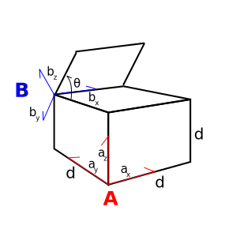
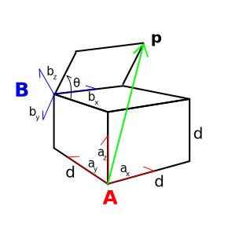
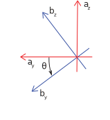
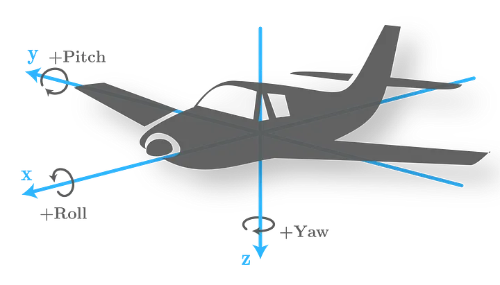

##################
 Reference frames
##################

Reference frames are useful when examining the relationships between bodies in multibody systems.
They also appear in physics when distinguishing inertial frames, where Newton's laws apply, from
non-inertial ones. We can loosely define a reference frame as the `Euclidean space
<https://en.wikipedia.org/wiki/Euclidean_space>`_ spanned by orthogonal unit vectors oriented
following the `right-hand rule <https://en.wikipedia.org/wiki/Right-hand_rule>`_. This may be a
two-dimensional space spanned by two orthogonal unit vectors, or a three-dimensional space spanned
by three. In this course, reference frames have no position in space; they are defined by
orientation alone. We often define reference frames relative to some "base frame" that we consider
fixed in space, such as the center of mass of a drone or the center of the Earth in a navigation
system. We can think of reference frames intuitively as perspectives: if you rotate your phone while
taking a picture, the world rotates relative to the reference frame of the camera.

.. _conventions-read-this-first:

******************************
 Conventions: read this first
******************************

.. warning::

    Rotations are not hard. What makes them confusing is that different books, libraries, and fields
    write them down differently, and the notation usually does not tell you which way it is being
    used. Two equations that look the same can mean opposite things. Before reading further on this
    page, or any other source about rotations, you need to know which conventions are in play. There
    are six of them.

The six questions
=================

Every rotation matrix you encounter is fixed by six choices:

1. **Right-handed or left-handed coordinate system?** Does :math:`\hat{x} \times \hat{y}` equal
   :math:`+\hat{z}` or :math:`-\hat{z}`?
2. **Active or passive?** Does the matrix rotate the vector, or rotate the frame?
3. **Which frame to which frame?** A rotation matrix relates two frames. Which way around?
4. **Intrinsic or extrinsic?** When you chain rotations, are the later ones about the original axes
   or about the axes left over from the previous step?
5. **Column vectors or row vectors?** :math:`{\bf R}\, {\bf v}` or :math:`{\bf v}\, {\bf R}`?
6. **Sign of a positive angle?** Is a positive number a right-hand-rule rotation about the named
   axis, or the opposite?

The conventions used on the rest of this page are listed at the end of this section. When you read
someone else's text, your first job is to work out which choice they make on each of these six. The
text will almost never say.

Active vs. passive
==================

The same 3×3 matrix can mean two completely different things.

**Active.** The frame stays still. The vector moves. You start with a vector :math:`\vec v` and end
with a different vector :math:`\vec v\,'`, both written in the same coordinates:

.. math::

    {\bf v}' = {\bf R}_{\mathrm{active}}\, {\bf v}.

**Passive.** The vector stays still. The frame moves. One physical arrow has two sets of
coordinates, one in frame :math:`A` and one in frame :math:`B`. The matrix converts between them:

.. math::

    {\bf v}^{B} = {\bf R}_{A \to B}\, {\bf v}^{A}.

These two matrices are transposes of each other, not equal. If frame :math:`B` is rotated by
:math:`+\theta` about x relative to frame :math:`A`:

- The passive matrix going *from* :math:`A` *to* :math:`B` is

  .. math::

      {\bf R}_{A \to B}(\theta)
      =
      \begin{bmatrix}
      1 & 0 & 0 \\
      0 & \cos\theta & \sin\theta \\
      0 & -\sin\theta & \cos\theta
      \end{bmatrix}.

- The active matrix that rotates a vector by :math:`+\theta` about x is

  .. math::

      {\bf R}_{\mathrm{active}}(\theta)
      =
      \begin{bmatrix}
      1 & 0 & 0 \\
      0 & \cos\theta & -\sin\theta \\
      0 & \sin\theta & \cos\theta
      \end{bmatrix}.

Rotating the *frame* by :math:`+\theta` makes a fixed vector look as if *it* had been rotated by
:math:`-\theta`. This is where most sign errors come from.

.. warning::

    The shape of the matrix does not tell you which convention is in use. The two matrices above are
    also, respectively, the passive :math:`{\bf R}_{B \to A}` and the passive :math:`{\bf R}_{A \to
    B}` (passive matrices in opposite directions are transposes of each other, so they swap places).
    So one matrix shape has *four* possible meanings: active by :math:`+\theta`, active by
    :math:`-\theta`, passive :math:`A \to B`, passive :math:`B \to A`. The surrounding text has to
    tell you which one. Never decide based on the matrix alone.

.. note::

    Robotics, navigation, and aerospace texts almost always use **passive** rotations: matrices
    relate a body frame to a world frame and act on coordinates. Computer graphics and game engines
    almost always use **active** rotations: matrices move models around. Mixing a graphics tutorial
    and a robotics paper without noticing will quietly flip every sign in your code.

Handedness
==========

A coordinate system is either right-handed or left-handed:

.. math::

    \text{right-handed:} \quad \hat{x} \times \hat{y} = +\hat{z},
    \qquad
    \text{left-handed:} \quad \hat{x} \times \hat{y} = -\hat{z}.

Point your right hand's fingers from :math:`\hat{x}` toward :math:`\hat{y}`. If your thumb points
along :math:`\hat{z}`, the system is right-handed. If it points the other way, it is left-handed.

This matters because the right-hand rule that defines a positive rotation is itself a statement
about handedness. In a left-handed system, the same matrix produces the opposite physical rotation.
Copying a rotation formula from a left-handed source into right-handed code without flipping signs
gives you mirrored rotations everywhere.

.. note::

    Robotics, physics, classical mechanics, SLAM, ROS, OpenCV, and COLMAP all use right-handed
    systems. Unity, Unreal, and DirectX use left-handed systems. OpenGL is right-handed in world
    space. This page is right-handed throughout.

To check a library: compute :math:`\hat{x} \times \hat{y}` using the library's own cross-product.
Right-handed if you get :math:`\hat{z}`, left-handed if you get :math:`-\hat{z}`.

From-frame and to-frame
=======================

A passive rotation matrix is meaningless until you say which frame is the source and which is the
destination. Notations in the wild include :math:`{\bf R}_A^B`, :math:`{\bf R}_{AB}`, :math:`{}^B
{\bf R}_A`, :math:`{\bf R}_{A \to B}`, and others, and they do not all mean the same thing.

On this page we use:

.. math::

    {\bf v}^{B} = {\bf R}_{A \to B}\, {\bf v}^{A}.

Read it left-to-right: *from* :math:`A`, *to* :math:`B`. Two facts worth memorising:

- The **rows** of :math:`{\bf R}_{A \to B}` are the basis vectors of :math:`B` written in
  :math:`A`-coordinates.
- The **columns** of :math:`{\bf R}_{A \to B}` are the basis vectors of :math:`A` written in
  :math:`B`-coordinates.

The inverse is the transpose:

.. math::

    {\bf R}_{B \to A} = {\bf R}_{A \to B}^{\,T}.

When you read another author's equation :math:`{\bf v}_2 = {\bf R}\, {\bf v}_1`, the first question
is: *what frames are these vectors in?* Until you know, the matrix is just nine numbers.

.. warning::

    The phrase "body-to-world rotation" has two opposite meanings in the literature:

    1. The matrix :math:`{\bf R}` such that :math:`{\bf p}^{\text{world}} = {\bf R}\, {\bf
       p}^{\text{body}}`. This is the SLAM and robotics convention.
    2. The matrix that, applied as an *active* rotation, takes the world basis and rotates it onto
       the body basis. This is the inverse of the first.

    Both appear in published papers, sometimes in the same paper. The only safe way to read a matrix
    is to find an equation where it acts on a vector and check what the input and output frames
    actually are. Do not trust the name.

Chaining rotations
==================

When you compose several rotations, two more choices appear.

**Intrinsic** rotations are about the axes of the frame *as already rotated by the previous steps*.
The axes move with the frame.

**Extrinsic** rotations are always about the original fixed axes. The axes never move.

The useful fact is: **an intrinsic sequence equals the extrinsic sequence in reverse order.** That
is,

.. math::

    \text{intrinsic } (i_1, i_2, i_3)
    \;\;=\;\;
    \text{extrinsic } (i_3, i_2, i_1).

This is why "do I left-multiply or right-multiply?" is a confusing question. Forget it. There is
only one rule you need:

**Adjacent indices must match. The rightmost matrix acts first.**

If you have :math:`{\bf R}_{A \to B}` and then :math:`{\bf R}_{B \to C}`, the composition is

.. math::

    {\bf R}_{A \to C} = {\bf R}_{B \to C}\, {\bf R}_{A \to B}.

That's it. For an extrinsic sequence of roll, pitch, yaw about world axes (rolled first), the matrix
that takes world coordinates to body coordinates is

.. math::

    {\bf R}_{\text{world} \to \text{body}}
    = {\bf R}_z(\psi)\, {\bf R}_y(\theta)\, {\bf R}_x(\phi).

The first physical rotation, :math:`{\bf R}_x(\phi)`, is on the right because the rightmost matrix
acts on the vector first. The same product also represents the intrinsic body-fixed sequence yaw,
then pitch, then roll, in the reversed order.

.. note::

    The name "ZYX Euler angles" can mean intrinsic ZYX, or extrinsic ZYX (which is the same rotation
    as intrinsic XYZ), or just "the factorisation :math:`R_z R_y R_x`" with the order of application
    not stated. Never trust the three-letter name. Look at the matrix product and how it is applied
    to a vector.

Column or row vectors
=====================

Almost all engineering and physics texts (this one included) treat vectors as columns and multiply
on the left:

.. math::

    {\bf v}' = {\bf R}\, {\bf v}.

A chain :math:`{\bf R}_3 {\bf R}_2 {\bf R}_1 {\bf v}` reads right-to-left: :math:`{\bf R}_1` first.

Some computer graphics APIs (DirectX, old OpenGL) treat vectors as rows and multiply on the right:

.. math::

    {\bf v}' = {\bf v}\, {\bf R}.

In a row-vector convention, every matrix is the transpose of its column-vector counterpart, and
chains read left-to-right. The choice of memory layout (row-major or column-major) is a separate
question and does not have to match the math convention. Check both when porting code.

Euler angles are not unique
===========================

Even after the convention is fixed, recovering Euler angles from a rotation matrix has two pitfalls.

First, two different triples of angles give the same matrix:

.. math::

    (\phi, \theta, \psi)
    \quad\text{and}\quad
    (\phi + \pi,\; \pi - \theta,\; \psi + \pi)

are both valid solutions. Libraries pick one branch, usually with :math:`\theta \in [-\pi/2,
\pi/2]`. Two libraries can return different numbers that are both correct.

Second, at gimbal lock (:math:`\theta = \pm\pi/2`), the first and third angles become coupled. Only
the sum :math:`\phi + \psi` is determined. Different libraries split it differently or return
``NaN``.

The practical rule: **do not exchange Euler angles between libraries or people.** Exchange rotation
matrices, or quaternions with a stated component order.

How to decode a library or a textbook
=====================================

Run this short protocol. Each step pins down one of the six questions.

**1. Handedness.** Compute :math:`\hat{x} \times \hat{y}` using the library's cross-product.
:math:`+\hat{z}` means right-handed, :math:`-\hat{z}` means left-handed. None of the later steps
mean anything until this is settled.

**2. Sign of a positive angle.** Make a "30° rotation about x" and apply it to :math:`(0, 1, 0)^T`.

- :math:`(0, \cos 30°, +\sin 30°)`: positive angle rotates y toward z.
- :math:`(0, \cos 30°, -\sin 30°)`: opposite sign convention.
- Anything else: degrees-vs-radians, wrong axis, or you did not apply the matrix the way you
  thought.

.. warning::

    Step 2 alone does not tell you active vs. passive. The matrix shape is the same for "active
    rotation by :math:`+\theta`" and "passive rotation :math:`B \to A` where B is rotated by
    :math:`+\theta` from A". You need step 3 to distinguish them.

**3. Active vs. passive.** Look for a named-frame constructor in the library: something like
``T_world_body``, ``R_from_body_to_world``, ``pose_in_world``, etc. If the library has one, build a
body-to-world rotation and apply it to the body's own x-axis, :math:`(1, 0, 0)^T`. If you get the
body's x-axis written in world coordinates, the matrix is the passive :math:`{\bf R}_{\text{body}
\to \text{world}}`. If the library has no such named constructor, it is almost certainly using
active rotations in graphics style.

For a textbook, you can't run code. Instead, find a sentence that names the matrix in plain language
("the rotation matrix from the body frame to the world frame") and find the equation where it is
applied to a vector. Cross-check that the input and output vectors are in the frames the sentence
claims. If they are, the matrix is passive in that direction. If the text instead says "rotates the
vector by an angle", the matrix is active.

**4. Chain order.** Compose two rotations the way the library documents, say ``R = Rx(30°) *
Ry(30°)``, and apply ``R`` to a vector. Work out by hand what you should get under both
interpretations:

- intrinsic Rx then Ry (the second Y is about the new y-axis),
- extrinsic Rx then Ry (Y is about the original y-axis).

Whichever matches tells you the chain order and whether ``*`` builds an intrinsic or extrinsic
product. These two choices are not independent: fixing one forces the other.

**5. Euler order.** Build a matrix yourself from three known angles in a known order, then ask the
library to extract Euler angles from it. Compare. A library that calls its convention "ZYX" may mean
intrinsic ZYX, extrinsic ZYX, or just "the product :math:`R_z R_y R_x` without saying which way it
is applied". Only the round-trip tells you which.

**6. Round-trip.** Build a non-trivial rotation from Euler angles, convert to a matrix, convert
back, and check you recover the originals (up to the branch and gimbal-lock cases above). If this
fails on generic input, the library is buggy or you mis-identified the convention earlier.

After these six steps you know everything: handedness, sign, active vs. passive, from/to direction,
chain order, and Euler convention.

Conventions on the rest of this page
====================================

- **Right-handed:** :math:`\hat{x} \times \hat{y} = \hat{z}`.
- **Passive:** matrices act on coordinates of vectors that stay physically fixed. We rotate frames,
  not bodies.
- **From-to:** :math:`{\bf R}_{A \to B}` maps :math:`A`-coordinates to :math:`B`-coordinates, so
  :math:`{\bf v}^B = {\bf R}_{A \to B}\, {\bf v}^A`.
- **Column vectors,** matrices on the left.
- **Chain rule:** in a product :math:`{\bf R}_{B \to C}\, {\bf R}_{A \to B}`, the rightmost matrix
  acts on the vector first.
- **Sign:** a positive angle is a right-hand-rule rotation.
- **Euler sequences:** intrinsic vs. extrinsic, and the axis order, are stated each time.

If a later equation on this page seems to contradict these, treat it as suspect and check signs
carefully.

**************
 Unit Vectors
**************

Vectors have both a magnitude and a direction. Unit vectors are vectors with a magnitude of *one*
oriented parallel to a direction (or dimension) in the reference frame they span. We can think of a
reference frame as a box in 3D. A unit vector points along the side of the box. For convenience, we
often like to imagine the unit vectors being aligned in a corner of a "box" pointing along the edges
of the box. A unit vector follows the right-hand rule. This means that a reference system :math:`A`
defined by the orthogonal unit vectors :math:`\hat{a}_x`, :math:`\hat{a}_y`, :math:`\hat{a}_z`, the
following cross-products hold

.. math::

    \hat{a}_x \times \hat{a}_y = \hat{a}_z

    \hat{a}_z \times \hat{a}_x = \hat{a}_y

    \hat{a}_y \times \hat{a}_z = \hat{a}_x

Note that the unit vectors :math:`\hat{a}_x`, :math:`\hat{a}_y`, :math:`\hat{a}_z` are by definition
fixed in reference frame :math:`A`. If we want to define a new reference frame :math:`B` relative to
frame :math:`A` we can express their relative orientation with the relationship between their
respective unit vectors. We'll examine this in the next section.

.. note::

    **Basis vectors** are vectors that define a reference frame, but they are not necessarily of
    unit length. When the basis vectors are normalized to have a magnitude of one, they become unit
    vectors. In an orthonormal reference frame, the basis vectors are both unit vectors and mutually
    perpendicular.

.. _simple-rotation-example:

*************************
 Simple Rotation Example
*************************

.. _fig:box:

    Box with sides :math:`d` with rotating lid

The figure :numref:`fig:box` depicts a box with sides :math:`d` and a rotating square lid with sides
:math:`d`. The lid is rotated by an angle :math:`\theta` relative to the box. To find the vector
:math:`\vec{p}` expressed in frame :math:`A`, we write it using the unit vectors of frame :math:`B`
and then substitute the relationship between the two frames.

.. _fig:box_w_vector:

    Box with sides :math:`d` with rotating lid and vector :math:`\vec{p}`

Using the unit vectors, we see that :math:`\vec{p} = d \hat{a}_y + d \hat{a}_z + d \hat{b}_x - d
\hat{b}_y`. By looking at the hinge, we can find the relationship between the unit vectors of frame
:math:`A` and frame :math:`B`.

.. _fig:box2d:

    2D representation of :numref:`fig:box` rotating lid

Looking at the hinge in :numref:`fig:box2d`, we use trigonometry to find

.. math::
    :label: x-rotation-example

    \hat{b}_x = \hat{a}_x

    \hat{b}_y = \cos(\theta) \hat{a}_y - \sin(\theta) \hat{a}_z

    \hat{b}_z = \sin(\theta) \hat{a}_y + \cos(\theta) \hat{a}_z

Substituting the frame :math:`B` unit vectors into the expression for :math:`\vec{p}`:

.. math::

    \vec{p} = d \hat{a}_y + d \hat{a}_z + d \hat{b}_x - d \hat{b}_y

    \vec{p} = d \hat{a}_y + d \hat{a}_z + d \hat{a}_x - d (\cos(\theta) \hat{a}_y - \sin(\theta) \hat{a}_z)

    p^A =
    \begin{bmatrix}
    d \\
    d - d \cos(\theta) \\
    d + d \sin(\theta)
    \end{bmatrix}

Intuitively, we know this to be the case, since we know that when the lid is closed (:math:`\theta =
0`) :math:`\vec{p} = d \hat{a}_x + d \hat{a}_z`, and when the lid is open (:math:`\theta =
\frac{\pi}{2}`) :math:`\vec{p} = d \hat{a}_x + d \hat{a}_y + 2d \hat{a}_z`.

We can write :eq:`x-rotation-example` in matrix form as

.. math::

    \begin{bmatrix}
    \hat{b}_x \\
    \hat{b}_y \\
    \hat{b}_z
    \end{bmatrix}
    =
    \begin{bmatrix}
    1 & 0 & 0 \\
    0 & \cos(\theta) & -\sin(\theta) \\
    0 & \sin(\theta) & \cos(\theta)
    \end{bmatrix}
    \begin{bmatrix}
    \hat{a}_x \\
    \hat{a}_y \\
    \hat{a}_z
    \end{bmatrix}
    =
    {\bf R}_A^B(\theta)
    \begin{bmatrix}
    \hat{a}_x \\
    \hat{a}_y \\
    \hat{a}_z
    \end{bmatrix}

This matrix is the transformation matrix **from** :math:`A` **to** :math:`B`, :math:`{\bf
R}_A^B(\theta)`, which means we can transform any vector in frame :math:`A` to its representation in
frame :math:`B` by means of matrix multiplication. This kind of transformation matrix belongs to a
group we call rotation matrices. More specifically, it belongs to the `special orthogonal group 3
(SO(3)) <https://en.wikipedia.org/wiki/3D_rotation_group>`_. This means that it has useful
properties such that its inverse is equal to its transpose, meaning :math:`{{\bf R}_B^A}^T(\theta) =
{{\bf R}_A^B}^{-1}(\theta) = {\bf R}_B^A(\theta)`, thus

.. math::

    {\bf v}^B = {\bf R}_A^B(\theta) {\bf v}^A

    {\bf v}^A = {{\bf R}_B^A}^T(\theta) {\bf v}^B = {{\bf R}_B^A} (\theta){\bf v}^B

Instead of tracking unit vectors, we can find :math:`p^A` directly by transforming the components of
:math:`\vec{p}` in frame :math:`B` using :math:`{\bf R}_B^A`.

.. note::

    We use the notation :math:`{\bf R}_{from}^{to}` for transformation matrices, also written
    :math:`{\bf R}_{A \to B}` in the conventions section above. They are the same notation.

.. math::

    p^A
    =
    \begin{bmatrix}
    0 \\
    d  \\
    d
    \end{bmatrix}
    +
    {\bf R}_B^A
        \begin{bmatrix}
    d \\
    -d  \\
    0
    \end{bmatrix}

where

.. math::

    {\bf R}_B^A
    =
    {{\bf R}_A^B}^T
    =
    {
    \begin{bmatrix}
    1 & 0 & 0 \\
    0 & \cos(\theta) & -\sin(\theta) \\
    0 & \sin(\theta) & \cos(\theta)
    \end{bmatrix}
    }^T
    =
    \begin{bmatrix}
    1 & 0 & 0 \\
    0 & \cos(\theta) & \sin(\theta) \\
    0 & -\sin(\theta) & \cos(\theta)
    \end{bmatrix}

Substituting gives

.. math::

    p^A
    =
    \begin{bmatrix}
    0 \\
    d  \\
    d
    \end{bmatrix}
    +
    \begin{bmatrix}
    1 & 0 & 0 \\
    0 & \cos(\theta) & \sin(\theta) \\
    0 & -\sin(\theta) & \cos(\theta)
    \end{bmatrix}
    \begin{bmatrix}
    d \\
    -d\\
    0
    \end{bmatrix}
    =
    \begin{bmatrix}
    d \\
    d - d \cos(\theta) \\
    d + d \sin(\theta)
    \end{bmatrix} \  \ \blacksquare.

We can easily implement this in SymPy

.. jupyter-execute::

    import sympy as sm
    sm.init_printing(use_latex='mathjax')
    from sympy import sin, cos

    theta, d = sm.symbols('theta d')
    R_b_to_a = sm.Matrix([  [1, 0, 0],
                            [0, cos(theta), sin(theta)],
                            [0, -sin(theta), cos(theta)]])
    R_b_to_a

.. jupyter-execute::

    v_A = sm.Matrix([0, d, d]) + R_b_to_a @ sm.Matrix([d, -d, 0])
    v_A

************************
 SymPy Reference Frames
************************

As shown in :ref:`simple-rotation-example`, even simple problems can become tedious when working
with reference frames by hand. The SymPy module :external:py:obj:`~sympy.physics.vector` handles
this through the :external:py:class:`~sympy.physics.vector.frame.ReferenceFrame` class.

.. jupyter-execute::

    from sympy.physics.vector import ReferenceFrame

    A = ReferenceFrame('A')

Each reference frame has three associated basis vectors:

.. jupyter-execute::

    A.x, A.y, A.z

New vectors are built from the basis vectors:

.. jupyter-execute::

    a = d*A.y + d*A.z
    a

SymPy conventions
=================

Before using the library we apply the decoding protocol from :ref:`conventions-read-this-first` to
pin down exactly which conventions SymPy uses.

**Step 1. Handedness.** Compute :math:`\hat{a}_x \times \hat{a}_y`:

.. jupyter-execute::

    A.x.cross(A.y)

The result is :math:`\hat{a}_z`, so SymPy reference frames are **right-handed**.

**Step 2. Sign of a positive angle.** Orient a test frame :math:`T` at :math:`+30°` about
:math:`\hat{a}_x` and apply its direction cosine matrix to :math:`(0,\,1,\,0)^T`:

.. jupyter-execute::

    from sympy import pi, Matrix

    T = A.orientnew('T', 'Axis', [pi/6, A.x])  # +30° about x
    T.dcm(A) * Matrix([0, 1, 0])

The z-component is :math:`-\sin(30°)`. An active rotation matrix :math:`R_x(+30°)` would give
:math:`+\sin(30°)` by rotating :math:`\hat{y}` toward :math:`\hat{z}`. The negative sign tells us
``T.dcm(A)`` is not the active rotation matrix.

**Step 3. Active vs. passive.** Orient a frame :math:`T_2` at :math:`+90°` about :math:`\hat{a}_z`,
so its x-axis points along :math:`\hat{a}_y`. The passive matrix :math:`{\bf R}_{T_2 \to A}` should
map the body x-axis :math:`(1,\,0,\,0)^T` to its world-frame coordinates :math:`(0,\,1,\,0)^T`:

.. jupyter-execute::

    T2 = A.orientnew('T2', 'Axis', [pi/2, A.z])  # +90° about z: T2.x points along A.y
    A.dcm(T2) * Matrix([1, 0, 0])

The result is :math:`(0,\,1,\,0)^T` as expected, confirming that ``A.dcm(T2)`` is the passive
:math:`{\bf R}_{T_2 \to A}`. The general rule follows: ``B.dcm(A)`` returns :math:`{\bf R}_{A \to
B}`, the passive matrix mapping :math:`A`-coordinates to :math:`B`-coordinates.

The :math:`-\sin` in step 2 is now explained: :math:`{\bf R}_{A \to T}` converts the fixed
:math:`\hat{a}_y` vector into :math:`T`-frame coordinates, where it appears rotated backward by
:math:`-30°` from :math:`\hat{t}_y`.

We can orient a new frame :math:`B` relative to :math:`A` with an axis rotation about
:math:`\hat{a}_x`:

.. jupyter-execute::

    B = A.orientnew('B', 'Axis', [-theta, A.x]) # negative x-axis rotation from box example

The rotation matrix between two frames is obtained with the *direction cosine matrix* (`dcm`)
method:

.. jupyter-execute::

    A_to_B = B.dcm(A)  # R_{A→B}: maps A-coordinates to B-coordinates
    A_to_B

We can now solve the example from :numref:`fig:box_w_vector`:

.. jupyter-execute::

    b = d*B.x - d*B.y
    p = a + b
    p

With the `to_matrix` method, SymPy resolves the vector into any frame that is connected by a known
orientation relationship:

.. jupyter-execute::

    p.to_matrix(A) # Print as matrix relative to frame A

Implementation Details
======================

The `ReferenceFrame` class stores its name as a string and its orientation as a direction cosine
matrix (`sympy.Matrix`). Relationships to other frames are kept in a private dictionary,
`_Frame__frame_dict`, with `ReferenceFrame` objects as keys and DCMs as values. Orientations are
stored bi-directionally: when frame :math:`A` is oriented relative to :math:`B`, both :math:`A`'s
dictionary (key :math:`B`, DCM) and :math:`B`'s dictionary (key :math:`A`, transposed DCM) are
updated.

.. admonition:: Exercise

    Use SymPy ReferenceFrames to find the position of the end effector of the SCARA robot shown
    below, relative to the robot base (origin). Use :math:`\theta` for joint angles, :math:`d` for
    link lengths, and :math:`J3` for the z-displacement.

    .. figure:: https://upload.wikimedia.org/wikipedia/commons/0/09/SCARA_robot_2R.png
        :width: 50%

        Mitsubishi Electric Automation, Inc. 500 Corporate Woods Pkwy - Vernon Hills, IL - 60061 -
        US, CC BY-SA 4.0 <https://creativecommons.org/licenses/by-sa/4.0>, via Wikimedia Commons

.. dropdown:: Solution
    :color: success

    .. jupyter-execute::

        from sympy import symbols
        from sympy.physics.vector import ReferenceFrame

        theta1, theta2, theta3 = symbols('theta1:4') # Angles
        J3, d1, d2 = symbols('J3 d_1 d_2') # Distances (z-displacement is defined by actuator height)

        origin = ReferenceFrame('O')
        J1 = origin.orientnew('J1', 'Axis', [theta1, origin.z])
        J2 = J1.orientnew('J2', 'Axis', [theta2, J1.z])
        J4 = J2.orientnew('J4', 'Axis', [theta3, J2.z])

        p = d1 * J1.x + d2 * J2.x + J3 * J4.z
        p.to_matrix(origin) # Print matrix form relative to origin

**************
 Euler angles
**************

.. note::

    Rotation conventions vary widely across textbooks and libraries. The conventions used on this
    page are set out in the :ref:`Conventions: read this first <conventions-read-this-first>`
    section at the top.

In three-dimensional space we can reach any orientation by applying three separate rotations. If
each axis is used once (e.g. X, Y, Z) the sequence is called `Tait-Bryan angles
<https://en.wikipedia.org/wiki/Euler_angles#Tait-Bryan_angles>`_. If one axis is repeated (e.g. X,
Y, X) the sequence is called `proper Euler angles
<https://en.wikipedia.org/wiki/Euler_angles#Classic_Euler_angles>`_ :cite:t:`sensorbook`. Tait-Bryan
angles are the most intuitive because they correspond directly to *roll, pitch, and yaw*. For
example, starting from frame :math:`A`, we can yaw about :math:`\hat{a}_z` to get frame :math:`A'`,
then pitch about :math:`\hat{a'}_y` to get :math:`A''`, then roll about :math:`\hat{a''}_x` to get
the final orientation. Each rotation uses the axis as it was left by the previous step; this is
called an *intrinsic* sequence.

Intrinsic and Extrinsic Rotations
=================================

Both approaches were defined in the :ref:`conventions-read-this-first` section. The animations below
show them applied to an airplane undergoing a yaw-pitch-roll sequence, adapted from
:cite:t:`plein2019`. The axis convention for the airplane is shown in :numref:`fig:plane_axes`.

.. _fig:plane_axes:

    Axis orientation of the airplane used in the animations below.

.. raw:: html

    

      <figure style="text-align: center; flex: 1; min-width: 260px;">
        
        <figcaption><b>Intrinsic Z&#x2192;Y&#x2019;&#x2192;X&#x2019;&#x2019;</b>: Yaw about Z, then pitch about the rotated Y&#x2019;, then roll about the doubly-rotated X&#x2019;&#x2019;.</figcaption>
      </figure>
      <figure style="text-align: center; flex: 1; min-width: 260px;">
        
        <figcaption><b>Extrinsic X&#x2192;Y&#x2192;Z</b>: Roll, pitch and yaw each about the original fixed global axes.</figcaption>
      </figure>
    

Despite the step-by-step paths looking different, both sequences produce the **same final
orientation**. This is the intrinsic-extrinsic equivalence explored in the next section.

An intrinsic sequence of rotation can be written as

.. math::

    \begin{align*}
    \{a'_x, a'_y, a'_z\} &= R_{z, \psi} \{a_x, a_y, a_z\}, \\[1mm]
    \{a''_x, a''_y, a''_z\} &= R_{y', \theta} \{a'_x, a'_y, a'_z\}, \\[1mm]
    \{a'''_x, a'''_y, a'''_z\} &= R_{x'', \phi} \{a''_x, a''_y, a''_z\}.
    \end{align*}

(Derived from :cite:t:`sensorbook`)

The example above implements:

1. First rotation: Z-axis of initial frame A by angle :math:`\psi`
2. Second rotation: Y-axis of the rotated frame A' by angle :math:`\theta`
3. Third rotation: X-axis of the new rotated frame A'' by angle :math:`\phi`

An extrinsic rotation sequence means that we transform around the same axes:

.. math::

    \{a'''_x, a'''_y, a'''_z\} = R_{z, \psi} R_{y, \theta} R_{x, \phi} \{a_x, a_y, a_z\}.

(Derived from :cite:t:`sensorbook`)

The example above implements:

1. First rotation: Fixed X-axis of A by :math:`\phi`
2. Second rotation: Fixed Y-axis of A by :math:`\theta`
3. Third rotation: Fixed Z-axis of A by :math:`\psi`

Intrinsic-extrinsic equivalence
===============================

Intrinsic rotations yield the same result as extrinsic rotations carried out in the opposite
sequence :cite:t:`sensorbook`. Working out the math explicitly for the ZYX case:

.. math::

    \begin{align*}
    \{a'''_x, a'''_y, a'''_z\} &= R_{x'', \phi} R_{y', \theta} R_{z, \psi} \{a_x, a_y, a_z\} \\[1mm]
    &= R_{z, \psi} R_{y, \theta} R_{x, \phi} \{a_x, a_y, a_z\}.
    \end{align*}

We can now relate this to the ZYX convention often used in navigation. It's common to use the
intrinsic sequence of rotation yaw-pitch-roll (Z -> Y -> X), which we now know is equivalent to the
extrinsic sequence of rotation roll-pitch-yaw (X -> Y -> Z): :math:`R (\phi, \theta, \psi) = R_{a_z,
\psi}R_{a_y, \theta}R_{a_x, \phi}`

.. math::

    \begin{align*}
    R_{a_x,\phi} &= \begin{bmatrix} 1 & 0 & 0 \\ 0 & c\phi & -s\phi \\ 0 & s\phi & c\phi \end{bmatrix} \\
    R_{a_y,\theta} &= \begin{bmatrix} c\theta & 0 & s\theta \\ 0 & 1 & 0 \\ -s\theta & 0 & c\theta \end{bmatrix} \\
    R_{a_z,\psi} &= \begin{bmatrix} c\psi & -s\psi & 0 \\ s\psi & c\psi & 0 \\ 0 & 0 & 1 \end{bmatrix} \\
    R(\phi, \theta, \psi)
    &= \begin{bmatrix} c\psi c\theta & -s\psi c\phi + c\psi s\theta s\phi & s\psi s\phi + c\psi s\theta c\phi \\ s\psi c\theta & c\psi c\phi + s\psi s\theta s\phi & -c\psi s\phi + s\psi s\theta c\phi \\ -s\theta & c\theta s\phi & c\theta c\phi \end{bmatrix}
    \end{align*}

.. note::

    c = cos, s = sin

SymPy 3D rotations
==================

The sympy method :external:py:obj:`~sympy.physics.vector.frame.ReferenceFrame.orient_body_fixed`
implements three successive body fixed simple axis right-hand rotations. We can orient a new
reference frame by providing the parent frame, three angles and the order of rotation. The example
below orients a new frame :math:`B` relative to frame :math:`A` by an intrinsic ZYX sequence of
rotations (or XYZ extrinsic sequence of rotation).

.. jupyter-execute::

    A = ReferenceFrame('A')
    B = ReferenceFrame('B')

    phi, theta, psi = symbols('phi, theta, psi')

    B.orient_body_fixed(A, (psi, theta, phi), 'ZYX') # Tait-Bryan intrinsic ZYX rotation
    B_to_A = B.dcm(A).T  # R_{B→A}: maps B-coordinates to A-coordinates
    B_to_A

The result agrees with the ZYX matrix derived in the previous subsection. Putting the arguments in
the wrong order would give a different result. This is why you need to know how a library implements
rotations before using it; if in doubt, implement the rotation yourself.

SymPy's `orient_explicit()` method orients a frame using an explicit direction cosine matrix. This
is error-prone if the DCM is defined incorrectly, so use it with caution.

.. jupyter-execute::

    from sympy import Matrix, cos, sin

    N = ReferenceFrame('N')
    A = ReferenceFrame('A')
    theta = symbols('theta')

    # DCM for rotating about z-axis
    dcm = Matrix([
        [cos(theta), -sin(theta), 0],
        [sin(theta), cos(theta), 0],
        [0, 0, 1]
    ])

    A.orient_explicit(N, dcm) # Orient frame A w.r.t. to frame N
    A_to_N = N.dcm(A)  # R_{A→N}: maps A-coordinates to N-coordinates
    A_to_N

.. admonition:: Exercise: Skydio drone

    The drone illustrated in the picture below is oriented relative to the inertial frame :math:`N`.
    Use Euler angles ZXY convention to find the orientation of the camera relative to frame
    :math:`N` by using the intermediary frames :math:`BODY` and :math:`CAM`. Take both the drone
    orientation and the camera gimbal orientation into account.

    .. figure:: figures/skydio_drone.jpg
        :name: skydio-drone

        Image copyright Vox Media, used under fair use for educational purposes.

*****************
 Further reading
*****************

There are many different ways of representing rotations. We'll take a closer look at the most
commonly used way of representing orientation in the section :ref:`Quaternions (WIP) <quaternions>`.
